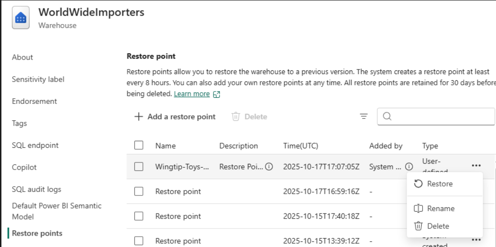

# Fabric CI/CD Deployment Repository

This repository provides a shared, abstracted codebase for Microsoft Fabric CI/CD deployments. Product teams sync their Fabric items into this repo and leverage a common deployment framework without duplicating CI/CD logic.

The framework leverages this project here: https://github.com/microsoft/fabric-cicd

## Purpose
- Centralize CI/CD logic for Fabric deployments.
- Keep team-specific assets (notebooks, lakehouses, etc.) separated from pipeline/framework code.
- Enforce consistent structure and configuration across environments (DEV/QA/PROD).

## Repository Structure
```
.
├─ attached_config/
│  └─ target_deployment.yml   # Required: framework configuration
├─ fabric_items/               # Required folder name
│  ├─ parameter.yml            # Required: environment replacements
│  ├─ <your Fabric items>      # e.g., *.Notebook, *.Lakehouse, etc.
└─ README.md
```

Notes
- The folder name fabric_items is required by the framework. Do not rename it.
- The file parameter.yml must live inside the fabric_items directory.

## How Deployments Work (at a glance)
1. Teams sync Fabric-created items (e.g., Lakehouse, Notebook) into fabric_items/.
2. Repo owners maintain attached_config/target_deployment.yml to define the target workspace and items in scope.
3. Repo owners maintain fabric_items/parameter.yml to apply environment-specific value replacements.
4. On commit to eligible branches, the pipeline runs and deploys items in scope to the configured Fabric workspace.

## target_deployment.yml
This file passes critical information to the framework:
- target_workspace_name: Human-readable Fabric workspace name.
- target_workspace_id: GUID of the target Fabric workspace.
- repo_directory: Must be fabric_items (hard-coded in the framework).
- item_type_in_scope: List of item types to deploy. If Notebook is included, all items with .Notebook under fabric_items will be deployed; similarly for other types.

Example
```yaml
# attached_config/target_deployment.yml
# Names/keys may vary by framework version; align with your framework docs.
target_workspace_name: "Contoso Fabric DEV"
target_workspace_id: "00000000-0000-0000-0000-000000000000"
repo_directory: "fabric_items"   # Do not change
item_type_in_scope:
  - "Notebook"
  - "Lakehouse"
```

## parameter.yml
This file is used to find and replace environment-specific values needed for deployment (e.g., workspace_id, item_id, Key Vault URIs, AAD tenant/client secrets). It must be located at fabric_items/parameter.yml.

For more information, please navigate here: https://microsoft.github.io/fabric-cicd/latest/how_to/parameterization/#parameterization

Example (illustrative only)
```yaml
key_value_replace:
  - find_key: $.variables[?(@.name=="workspace_id")].value
    replace_value:
      DEV: <workspace-guid-dev>
      QA: <workspace-guid-qa>
      PROD: <workspace-guid-prod>
    item_type: "VariableLibrary"
    item_name: "vars"
  - find_key: $.variables[?(@.name=="kv_uri")].value
    replace_value:
      DEV: https://<your-kv-dev>.vault.azure.net/
      QA: https://<your-kv-qa>.vault.azure.net/
      PROD: https://<your-kv-prod>.vault.azure.net/
    item_type: "VariableLibrary"
    item_name: "vars"
# Add additional keys as required by your items and framework
```

Tips
- Keep values for DEV/QA/PROD in sync with your enterprise Key Vault and app registrations.
- Add/adjust entries to match the variables used by your Fabric items.

## Pipeline and Error Logs
- The CI/CD pipeline deploys only the item types listed in item_type_in_scope.
- On failure, an error log is published as a pipeline artifact for debugging (e.g., errorlog artifact containing fabric_cicd.error.log). Check the pipeline run’s Artifacts tab and logs for details.

## Getting Started
1. Create or verify attached_config/target_deployment.yml with the correct workspace info and item types in scope.
2. Place or sync your Fabric items into fabric_items/ (keep the folder name unchanged).
3. Update fabric_items/parameter.yml with the required find/replace mappings for each environment.
4. Commit and push. The pipeline will run and deploy the items in scope to the target workspace.

## Images and Diagrams

- Overall Architecture
  


## Troubleshooting
- Ensure repo_directory is set to fabric_items.
- Ensure parameter.yml exists at fabric_items/parameter.yml and contains the required keys.
- Confirm item_type_in_scope contains the item types you expect to deploy.
- Verify workspace ID/name values are correct and the service connection has required permissions.


## Additional Solutions
- Please explore additional solutions below

## Conditional Masking
Imagine a scenario where you want to apply masking on columns when a specific condition occurs, however you don't want the mask applied on every record in the column, only if they meet a specific condition.  This is conditional masking.  This is a scenario where you can't apply Dynamic Data Masking (at the time of this writing) because this must take place on either the entirety of a column, not a subset of the column that meets a certain condition.  This is too complex for functions to apply at runtime to a view as well, so there are limited options.

One option is to apply this directly to the data itself.  However this means if you want to have separate views for different users, you have to duplicate the data (one with the column masked, the other without the masking).  This may be fine if it's done on a dimension table, or some other table type where the number of records are small, but in general should be avoided.

A better option is to create a view with this logic applied and then create different roles, one for users that can see the data unmasked, another for users who can see the data masked.  It is important in this case to ensure that the users who are only supposed to see the masked data do not have access to the underlying table (as the masking is not applied there and these users would be able to see the data) nor access to the sql endpoint table where the mask is not applied.  This can be accomplished by not giving the users access to the underlying delta tables and only access to the sql endpoint.  Then, the role has to DENY GRANTs on the tables where the data is not masked.

The below is an example of such a use case.  Below there are students who may also be employees (such as if they are graduate or undergraduate students working as research assistants to help fund their studies).  In the case that the employee is also a student, their social security number must be masked so that only the last 4 digits can be seen.  

# Related Artifacts in this repo
Masking on Spark Data itself -> fabric_items/data_masking_spark_files_nb.Notebook
Masking on SQL Endpoint and Roles -> fabric_items/tsql_data_mask_ssn_nb.Notebook

- Architecture Diagram


## Azure Health Deidentification Service
Imagine a scenario where you have PHI data that needs to be either tagged, redacted, or surrogated.  The Azure Deidentification Service leverages a Microsoft managed machine learning classification model trained on health data to identify health elements in text files, and perform either tagging, redaction, or surrogation.  These files can be processed in real-time or via a job.  If the data is to be processed in a job, the data must be stored in a storage account in a text format (ideally .txt).  The job will point at this data and then write the processed data to a target container.  A comon practice for this is to have one container for the raw data, have a deidentification job point at this container, run the job, and then store the output in a deidentified container.  This way, only highly priveleged users can have access on the raw container while researchers and data scientists have access to the deidentified data.  In this repository, there is a notebook that shows many different ways of utilizing this service in Microsoft Fabric.  That notebook can be found here at this path: fabric_items/de-identification-service/deidenticiation-nb.Notebook/notebook-content.py


- Architecture Diagram


- Workflow Overview


## Enable SQL Audit Logs on Lakehouse SQL Analytics Endpoint

Enabling SQL audit logs is currently only possible via API. Follow the steps below to configure this feature.

### Prerequisites

- The calling Service Principal (SPN) must have the required API permission:

&nbsp;  
&nbsp;  


&nbsp;  
&nbsp;  

- Example: Permission enabled on the SPN:

&nbsp;  
&nbsp;  


&nbsp;  
&nbsp;  

- The SPN must also have the Audit permission on the lakehouse object:

&nbsp;  
&nbsp;  


&nbsp;  
&nbsp;  

- Example: Audit permission on the SPN group:

&nbsp;  
&nbsp;  


&nbsp;  
&nbsp;  

### Implementation Steps

1. **Fetch SPN Secret at Runtime**

  Replace the Key Vault information with your own:

&nbsp;  
&nbsp;  


&nbsp;  
&nbsp;  

2. **Patch SQL Endpoint**

  Use client code to perform the patch. Replace variables with your workspace_id and lakehouse_id:

&nbsp;  
&nbsp;  


&nbsp;  
&nbsp;  

## Note:  Although this appears to be working from the response, the audit logs are actually not being captured.  This has been escalated to the product group and they are working on a fix in the coming weeks


## Fabric Data Warehouse Restore Points

Use Case:  Mistakes happen to data, sometimes via corruption, sometimes via accidental drops

Solution:  Restore Points make it possible to roll your data warehouse back to an earlier state


What are Restore Points:
- Recovery points of the warehouse created by copying only the metadata, while referencing the data files in OneLake
- The metadata is copied while the underlying data of the warehouse stored as parquet files aren't copied
- These restore points can be used to recover the warehouse as of a prior point in time

System-Created Restore Points:
- These are created throughout the day and are available for thirty days.
- System-generated restore points are created automatically every eight hours
- A system created restore point might not be immediately available for a new warehouse
- There can be up to 180 system generated restore points at any given point in time
- System-created restore points can't be deleted


User-defined restore points:
- Enables the workspace admins to manually create restore points before and after large modifications made to the warehouse
- This ensures that the restore points are logically consistent, providing data protection and quick recovery time in case of any workload interruptions or user errors
- User-defined restore points are available for thirty calendar days and are automatically deleted on your behalf after the expiry of the retention period


```sql
SELECT
  BuyingGroup,
  COUNT(*) AS total_records
FROM dimension_customer
GROUP BY
  BuyingGroup;
```


Before running the restore, it may be helpful to see what active users are currently using the Data Warehouse, to inform them you are about to run a restore activity
```
-- See all currently active users
SELECT
    session_id,
    login_name AS UserName,
    host_name,
    program_name,
    status,
    login_time,
    last_request_start_time

FROM sys.dm_exec_sessions
WHERE is_user_process = 1;
```





After the restore point, I can see that the records with BuyingGroup Wingtip Toys have returned


