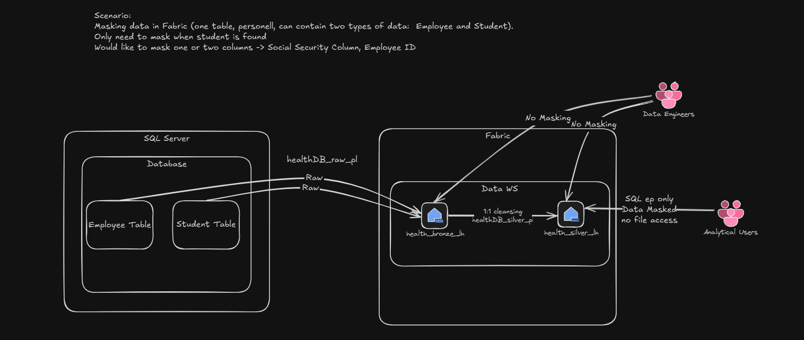

# Dynamic Data Masking (DDM) in Fabric — Example Overview

This document summarizes the masking examples contained in the `Dynamic-Data-Masking/`
folder. It covers **two distinct approaches**:

**Approach 1 — Conditional masking** (the original scenario), synthesized from:

1. The whiteboard diagram — `data-masking-fabric.excalidraw`
2. The Spark notebook — `data_masking_spark_files_nb.Notebook`
3. The T-SQL notebook — `tsql_data_mask_ssn_nb.Notebook`

**Approach 2 — Native Fabric DDM** (added later), synthesized from:

4. The whiteboard diagram — `ddm-native-example.excalidraw`
5. The T-SQL notebook — `tsql_native_ddm_ssn_nb.Notebook`

> **Note on naming and the two approaches:** The folder demonstrates masking *both*
> ways. **Approach 1** does **not** use Fabric's native **Dynamic Data Masking** feature;
> the scenario requires **conditional, row-level masking** (mask SSN only for employees
> who are also students), which native DDM cannot express, so it is implemented with
> **views, functions, and roles** (SQL analytics endpoint) and **Spark transformations**
> (the data itself). **Approach 2** uses native DDM (`ALTER COLUMN ... ADD MASKED WITH
> (FUNCTION = ...)`) for the simpler, **unconditional** "mask SSN for all non-privileged
> users" requirement — see [Section 5](#5-native-masking-unconditional).
>
> Per current Microsoft docs, native DDM *"Applies to: SQL analytics endpoint and
> Warehouse in Microsoft Fabric"* — so it is **not** Warehouse-only. It is, however,
> **unconditional and per-column**, which is why it fits Approach 2 but not Approach 1.

---

## 1. Scenario

From the diagram:

- A single population of people (personnel) contains **two overlapping types**:
  **Employees** and **Students**.
- Some individuals are **both** (e.g., graduate/undergraduate students who also work
  as research assistants).
- When a person is **also a student**, their **Social Security Number** (and optionally
  **Employee ID**) must be **masked** so only the last 4 digits are visible.
- Masking must be **conditional** — applied only to the matching subset of rows, not the
  whole column.

The diagram also spells out the core constraint:

> *"Since DDM does not support conditional masking, either the data can be masked at the
> table level and two different tables are maintained (one masked and one unmasked), or
> users that shouldn't see the unmasked data are not given access to the data themselves
> and only view the data through a SQL Endpoint (where they would only see a view that
> has the data masked)."*

---

## 2. Data Estate / Warehouse Context

The medallion flow shown in the diagram and referenced in the notebooks:

| Layer  | Item                | Role                                                        |
|--------|---------------------|-------------------------------------------------------------|
| Source | SQL Server Database | Origin system (`employee`, `student` tables)                |
| Bronze | `health_bronze_lh`  | Raw ingested copies (`healthDB_raw_pl` pipeline)            |
| Silver | `health_silver_lh`  | 1:1 cleansed copies (`healthDB_silver_pl` pipeline)        |
| Serve  | Warehouse           | SQL endpoint where views + roles enforce masking            |

**Warehouse / lakehouse identifiers** (from notebook metadata):

- Default warehouse (Lakewarehouse): `bea89836-d75a-4946-b79b-b0e8a10d9c0b`
- Silver lakehouse `health_silver_lh`: `70e18f53-f14f-41bd-b3d0-8060d42c4909`
- Bronze lakehouse: `d550d915-f3a8-418b-b3f4-c2cb369838c3`
- Workspace: `a8cbda3d-903e-4154-97d9-9a91c95abb42`

**Table schemas** (from the diagram):

```
employee
    id                      AUTONUMBER
    first_name              VARCHAR
    last_name               VARCHAR
    social_security_number  VARCHAR

student
    id                      AUTONUMBER
    first_name              VARCHAR
    last_name               VARCHAR
    social_security_number  VARCHAR
```

The join key between the two tables is `social_security_number` — that overlap is how a
person is identified as "an employee who is also a student."

---

## 3. Personas and Access (from the diagram)

| Persona           | Access path                          | Masking                         |
|-------------------|--------------------------------------|---------------------------------|
| Data Engineers    | Direct lakehouse / table / file access | **No masking** (see raw data)   |
| Analytical Users  | **SQL endpoint only**, no file access  | **Data masked** via the view    |

The key principle: masked users must **not** have access to the underlying Delta tables
or the unmasked SQL endpoint objects — only to the masked view. Otherwise they could
bypass the mask by reading the base table directly.

---

## 4. Conditional Masking

The original scenario requires **row-dependent** masking (mask SSN only for employees who
are also students). Native DDM cannot express this, so it is implemented with one of two
sub-methods below.

### Overview



### 4.1 Method — Mask in Spark (the data itself)

File: `data_masking_spark_files_nb.Notebook` (PySpark)

Flow:

1. Read `employee` and `student` from the **bronze** lakehouse.
2. Rename columns for clarity and **inner-join** on `social_security_number` to find
   the employees who are also students.
3. Collect that set of `employee_id`s into `emp_id_mask_list`.
4. Conditionally rewrite the SSN for only those IDs:

   ```python
   employee_df = employee_df.withColumn(
       "social_security_number",
       F.when(
           F.col("employee_id").isin(emp_id_mask_list),
           F.concat(F.lit("XXX-XX-"), F.substring(F.col("social_security_number"), -4, 4))
       ).otherwise(F.col("social_security_number"))
   )
   ```

The notebook also demonstrates two alternative postures:
- Filter the student rows out entirely (don't return them).
- Drop the `social_security_number` column altogether.

**Trade-off:** masking in Spark bakes the result into the persisted data. To serve both
masked and unmasked audiences you would have to maintain two copies of the table.

---

### 4.2 Method — Mask at the SQL Endpoint (views + roles)

File: `tsql_data_mask_ssn_nb.Notebook` (T-SQL, `sqldatawarehouse` kernel)

This is the recommended conditional pattern because the base data stays single-copy and
masking is enforced by **permissions**, not by duplicating data.

Steps in the notebook:

1. **Create a `sec` schema** to hold the security objects.
   *This is organizational only — masking does not require a separate schema. It groups
   security objects and makes schema-level permissioning convenient.*

2. **Create a masking function** `sec.fn_mask_ssn(@ssn)` that returns
   `XXX-XX-<last 4 digits>`.
   *Note: in the current notebook this function is defined but the view inlines the same
   logic rather than calling it — so the function is currently unused.*

3. **Create the masked view** `sec.vw_employee_masked` that conditionally masks the SSN:

   ```sql
   CREATE OR ALTER VIEW sec.vw_employee_masked AS
   SELECT employee.id,
          employee.first_name,
          CASE
            WHEN EXISTS (SELECT 1 FROM student
                         WHERE student.social_security_number = employee.social_security_number)
              THEN CONCAT('XXX-XX-', RIGHT(employee.social_security_number, 4))
            ELSE employee.social_security_number
          END AS social_security_number
   FROM employee;
   ```

4. **Create a role and lock down access** so masked readers only see the view:

   ```sql
   CREATE ROLE maskedReaders;
   GRANT SELECT ON OBJECT::sec.vw_employee_masked TO maskedReaders;
   DENY  SELECT ON OBJECT::dbo.employee           TO maskedReaders;
   DENY  SELECT ON OBJECT::dbo.student            TO maskedReaders;
   ```

5. **Add members** to the role:

   ```sql
   ALTER ROLE maskedReaders ADD MEMBER [adf_user_2@MngEnvMCAP372892.onmicrosoft.com];
   ```

**Why the DENY grants matter:** the mask lives only in the view. If a `maskedReaders`
member could `SELECT` from `dbo.employee` or `dbo.student` directly, they would see the
unmasked SSN. The `DENY` statements close that bypass.

---

## 5. Native Masking (Unconditional)

### Overview


Files: `tsql_native_ddm_ssn_nb.Notebook` (T-SQL) and `ddm-native-example.excalidraw` (diagram).

This is the **second approach** in the folder. It uses Fabric's **native Dynamic Data
Masking** instead of the view/role pattern. The requirement is simpler than Approach 1:
*mask `social_security_number` for everyone except explicitly privileged users* — no
row-level condition.

### Scenario (from `ddm-native-example.excalidraw`)

A single base table `dbo.employee` in the `health_silver_lh` warehouse has a native mask
applied to the `social_security_number` column:

```sql
ALTER TABLE dbo.employee
    ALTER COLUMN social_security_number
    ADD MASKED WITH (FUNCTION = 'partial(0,"XXX-XX-",4)');
```

Three personas query the **same** table and see **different** results based purely on
permissions — no duplicate tables, no views:

| Persona               | Sees                                   | Why                                          |
|-----------------------|----------------------------------------|----------------------------------------------|
| System Administrator  | Full `social_security_number`          | Admins/owners have **implicit `UNMASK`**     |
| `adf_user_2`          | Full `social_security_number`          | Explicitly granted **`UNMASK`**              |
| Dr. Klerx             | Last 4 digits only (`XXX-XX-####`)     | No `UNMASK` → sees the `partial()` mask       |

### Key mechanics

- **`GRANT UNMASK`** (not `DENY SELECT`) controls who sees real values:

  ```sql
  GRANT UNMASK TO [adf_user_2@MngEnvMCAP372892.onmicrosoft.com];
  ```

- **`UNMASK` is layered on top of `SELECT`** — it only affects *how* masked columns
  appear and does **not** grant read access or override a `DENY`. A user must already be
  able to `SELECT` the table before `UNMASK` has any effect.
- **Admins, the warehouse owner, and `db_owner` members always see unmasked data**, so
  masking cannot be verified from an admin session — test as a non-privileged principal
  (e.g. via `EXECUTE AS USER`).

### Screenshots

| Persona view | Image |
|--------------|-------|
| Masked user (no `UNMASK`)   | `images/image-of-employee-table-from-masked-user.png`   |
| Unmasked user (`UNMASK`)    | `images/image-of-employee-table-from-unmasked-user.png` |

### Why this is *not* used for Approach 1

Native DDM masks the **entire column unconditionally**. It cannot express "mask SSN only
when the employee is also a student," which is exactly the row-dependent rule Approach 1
requires. For that, the view + role pattern (Section 4.2) or the Spark transformation
(Section 4.1) is necessary.

---

## 6. Native Masking vs. Conditional Masking — When to Use Which

| Requirement                                   | Native Fabric DDM | This example (views/roles or Spark) |
|-----------------------------------------------|:-----------------:|:-----------------------------------:|
| Available surfaces                            | SQL analytics endpoint **and** Warehouse | Both |
| Mask an entire column for all/most users      | ✅ Best fit        | Possible but heavier                |
| **Conditional / row-dependent** masking       | ❌ Not supported   | ✅ Required approach                 |
| Single copy of data, permission-driven masking| ✅                | ✅ (view + role pattern)             |
| Different output for masked vs. unmasked users| Via `UNMASK` perm | Via separate views + DENY grants    |

Native DDM (`ADD MASKED WITH`) is available on **both** the Warehouse and the Lakehouse
SQL analytics endpoint (per current docs: *"Applies to: SQL analytics endpoint and
Warehouse in Microsoft Fabric"*), but it masks an entire column **unconditionally** and
cannot express the row-dependent (student-only) rule this scenario requires. It offers
exactly four mask functions — `default()`, `email()`, `random()` (numeric), and a custom
`partial()` string — none of which are conditional.

If a future requirement is simple, unconditional column masking, native DDM
(`ALTER TABLE ... ALTER COLUMN col ADD MASKED WITH (FUNCTION = 'partial(0,"XXX-XX-",4)')`
plus `GRANT UNMASK`) would be the lighter-weight choice. For the conditional scenario in
this folder, the view-and-role pattern is necessary.

---

## 7. Files in this Folder

| File                                            | Purpose                                              |
|-------------------------------------------------|------------------------------------------------------|
| `data-masking-fabric.excalidraw`                | Conditional-masking scenario whiteboard (Approach 1) |
| `data_masking_spark_files_nb.Notebook`          | Spark-based conditional masking on the data itself   |
| `tsql_data_mask_ssn_nb.Notebook`                | SQL-endpoint conditional masking via view + role + DENY |
| `ddm-native-example.excalidraw`                 | Native DDM scenario whiteboard (Approach 2)          |
| `tsql_native_ddm_ssn_nb.Notebook`               | Native DDM (`ADD MASKED WITH` + `GRANT UNMASK`)      |
| `images/image-of-employee-table-from-masked-user.png`   | Masked user's view of `dbo.employee`         |
| `images/image-of-employee-table-from-unmasked-user.png` | Unmasked user's view of `dbo.employee`       |
| `ddm_example_overview.md`                       | This overview document                               |
