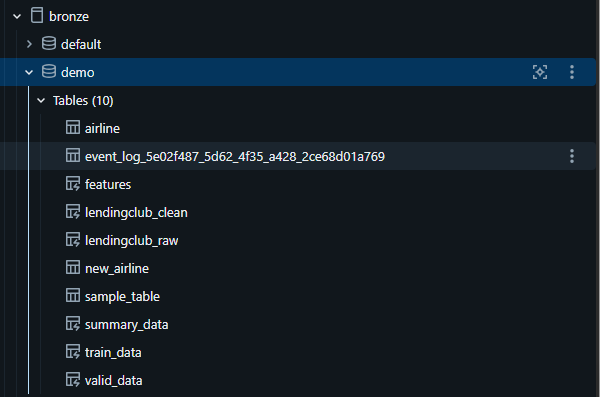
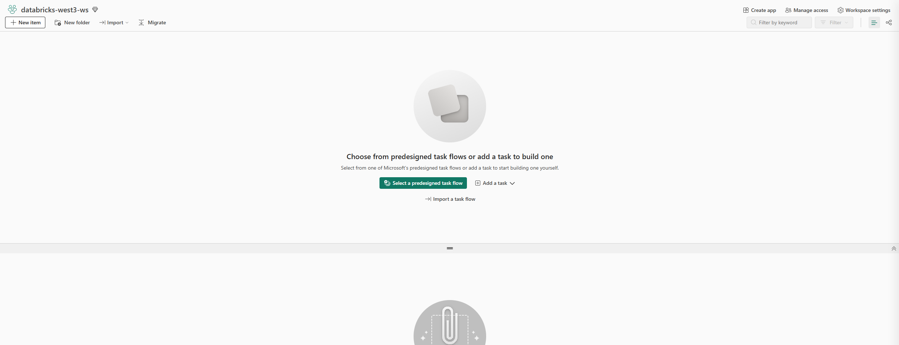
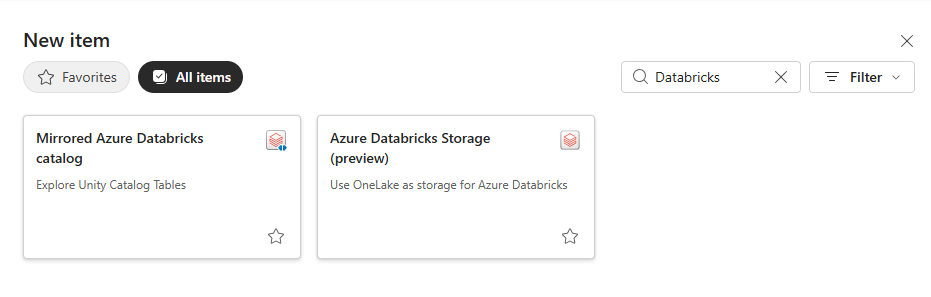

# Fabric and Databricks Together

> This guide shows how Databricks clients can pull data from Fabric servers, and how Fabric clients can pull data from Databricks servers.

 

## Pull Data from Databricks to Fabric

 

1. **Identify a catalog in Databricks.**

   

---

 

2. **Navigate to Fabric and identify the workspace to land the Databricks catalog data in.**

   

---

 

3. **Create a Mirrored Azure Databricks Catalog artifact.**

   

---

 

4. **Follow the wizard and create a connection if one does not already exist.**

---

 

5. **Choose a catalog (mine was `bronze` from earlier).**

   

---

 

6. **Choose the data you wish to bring in.**

   

---

 

7. **Create names and choose a sensitivity label if desired.**

   

---

 

8. **Wait until the shortcut is created.**

---

 

9. **Note that a shortcut has been created for the table, allowing zero-copy access to the data.**

   

---

 

10. **Add OneLake security as desired.**

---

 

11. **Change to the query endpoint.**

    

---

 

12. **Query the data as desired.**

    

---

 

13. **Note that notebooks can also be used as desired.**

    
