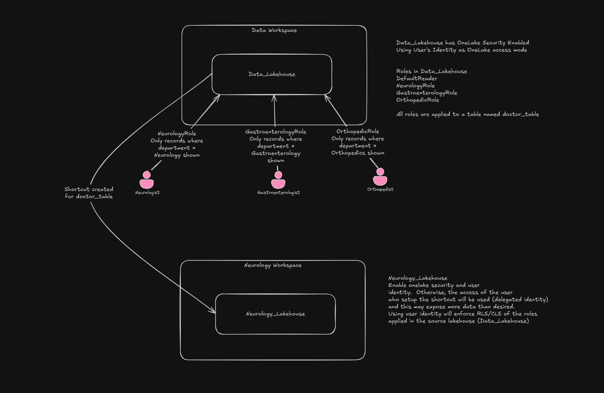

# OneLake Security POC - Row-Level Security (RLS) Implementation

> **Note:** OneLake Security is in **Public Preview** as of February 18, 2026.

## Architecture Overview

The architecture consists of a centralized **Data Workspace** containing a **Data_Lakehouse** with OneLake Security enabled. This lakehouse holds a `doctor_table` containing memos from doctors across multiple departments. OneLake Security roles restrict data access by department, ensuring personnel only see records relevant to them.

Department-specific workspaces (e.g., **Neurology Workspace**) can create their own lakehouses with **shortcuts** pointing back to the centralized `doctor_table`, enabling decentralized access while maintaining centralized security enforcement.

### Roles

The following OneLake Security roles are defined on the **Data_Lakehouse**, all applied to the `doctor_table`:

| Role | Filter | Description |
|------|--------|-------------|
| DefaultReader | None | Default role created when OneLake Security is enabled |
| NeurologyRole | `WHERE department = 'Neurology'` | Restricts access to Neurology records only |
| GastroenterologyRole | `WHERE department = 'Gastroenterology'` | Restricts access to Gastroenterology records only |
| OrthopedicRole | `WHERE department = 'Orthopedics'` | Restricts access to Orthopedics records only |

### Data Flow

1. An SPN (Service Principal) runs the implementation notebook to create the `doctor_table` and define the security roles on the Data_Lakehouse.
2. Users assigned to a role (e.g., a Neurologist assigned to NeurologyRole) query the Data_Lakehouse and see only their department's records via the SQL Analytics Endpoint.
3. Department workspaces can create shortcuts to the `doctor_table` for localized access, with RLS enforced at the source.

---

## Prerequisites

Before running the [`onelake_security_implementation_nb` notebook](fabric_items/Onelake%20Security/onelake_security_implementation_nb.Notebook/notebook-content.py), complete the following **manual** steps:

### 1. Create the Lakehouse Manually

The Data_Lakehouse **must be created manually by a user account** — it cannot be owned by a Service Principal (SPN). If the lakehouse is owned by an SPN, all OneLake Security API calls (including GET and PUT to `/dataAccessRoles`) will return `400 Bad Request` errors.

### 2. Enable OneLake Security

1. Navigate to the lakehouse in the Fabric portal.
2. Select **Manage OneLake Security (preview)**.
3. Enable OneLake Security.

### 3. Change SQL Analytics Endpoint to User Identity

1. Navigate to the SQL Analytics Endpoint of the lakehouse.
2. Go to the **Security** tab in the top ribbon.
3. Select **User's Identity** under OneLake access mode.
4. Confirm the prompt.

This step is required so that the SQL Analytics Endpoint evaluates permissions using the querying user's identity rather than a delegated identity.

### 4. Lakehouse Schema Requirement

The notebook used in this POC **does not support lakehouses with schemas**. Ensure the lakehouse is created without a schema structure, or issues may arise during table creation and role assignment.

### 5. Update Notebook Configuration

Before running the notebook, update the following variables to point to the correct resources:

- `workspace_id` — The ID of the workspace containing the Data_Lakehouse
- `lakehouse_id` — The ID of the manually created Data_Lakehouse
- `tenant_id` — Your Microsoft Entra ID tenant ID
- `object_id_user_neuro_role` — Object ID of the user to assign to the NeurologyRole
- `object_id_for_gastro_role` — Object ID of the user to assign to the GastroenterologyRole
- `object_id_for_ortho_role` — Object ID of the user to assign to the OrthopedicRole

---

## Implementation

The `onelake_security_implementation_nb` notebook (in the `fabric_items` folder) performs the following steps:

1. **Authenticates** using a Service Principal (SPN) via Azure Key Vault credentials.
2. **Creates the `doctor_table`** in the Data_Lakehouse with sample records from multiple departments (Neurology, Gastroenterology, Orthopedics, Cardiology, Dermatology).
3. **Defines and upserts OneLake Security roles** (NeurologyRole, GastroenterologyRole, OrthopedicRole) using the Fabric REST API (`PUT /v1/workspaces/{workspaceId}/items/{itemId}/dataAccessRoles`).
4. **Assigns users** to roles via their Microsoft Entra Object IDs.

> **Note:** The SPN creates the table and roles, but the lakehouse itself must be owned by a user account.

---

## Department Workspace Shortcuts

As shown in the architecture diagram, each department (e.g., Neurology) can have its own workspace with a lakehouse containing a **shortcut** to the `doctor_table` in the centralized Data_Lakehouse.

### Important: Enable User Identity Mode

By default, shortcuts use **Delegated Identity** mode — meaning the identity of the user who created the shortcut is used to access the target data. If that user is an admin with full access, **all data will be exposed** regardless of OneLake Security roles.

To enforce RLS through shortcuts:

1. **Enable OneLake Security** on the department lakehouse (e.g., Neurology_Lakehouse).
2. **Change the SQL Analytics Endpoint** to **User's Identity** mode.

This ensures the querying user's identity is passed through to the source Data_Lakehouse, where the RLS roles are evaluated correctly.

---

## Known Limitations (Preview)

| Limitation | Details |
|------------|---------|
| **SPN-owned lakehouses not supported** | The lakehouse owner cannot be a Service Principal. All `/dataAccessRoles` API calls will return `400` errors if the lakehouse is SPN-owned. |
| **Spark notebook access returns 403** | Users with RLS restrictions will receive `403 Forbidden` errors when accessing RLS-protected tables from a Spark notebook. The Spark engine makes direct file-level calls to OneLake storage (`onelake.dfs.fabric.microsoft.com`), and for RLS-protected tables, direct storage access is **blocked** rather than filtered. |
| **Lakehouse table preview unavailable** | RLS-restricted users cannot preview table data in the Lakehouse UI. The table will appear in the explorer but data will not load. |
| **Most permissive access wins** | When a user is a member of multiple roles, access combines via UNION (least restrictive). Ensure users are not inadvertently added to roles that grant broader access (e.g., DefaultReader). |
| **Admin/Member/Contributor bypass RLS** | Users with Admin, Member, or Contributor workspace roles bypass OneLake Security entirely and see all data. RLS only applies to Viewers and users with shared item access. |
| **OneLake Security roles not versioned to Git** | Data access roles are runtime security configuration and are **not** synced to Git via Fabric Git integration. Only `.platform`, `lakehouse.metadata.json`, and `shortcuts.metadata.json` are versioned. |

---

## Supported Access Methods for RLS Users

| Access Method | Works? | RLS Filtered? |
|---------------|--------|---------------|
| SQL Analytics Endpoint (source lakehouse, User Identity mode) | ✅ | ✅ |
| SQL Analytics Endpoint (shortcut lakehouse, User Identity mode) | ✅ | ✅ |
| Semantic models (DirectLake on OneLake mode) | ✅ | ✅ |
| Spark notebook | ❌ (403 Forbidden) | N/A |
| Lakehouse table preview | ❌ | N/A |
| Direct OneLake API access | ❌ (Blocked) | N/A |
