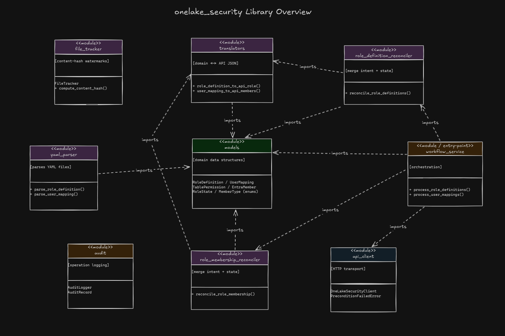
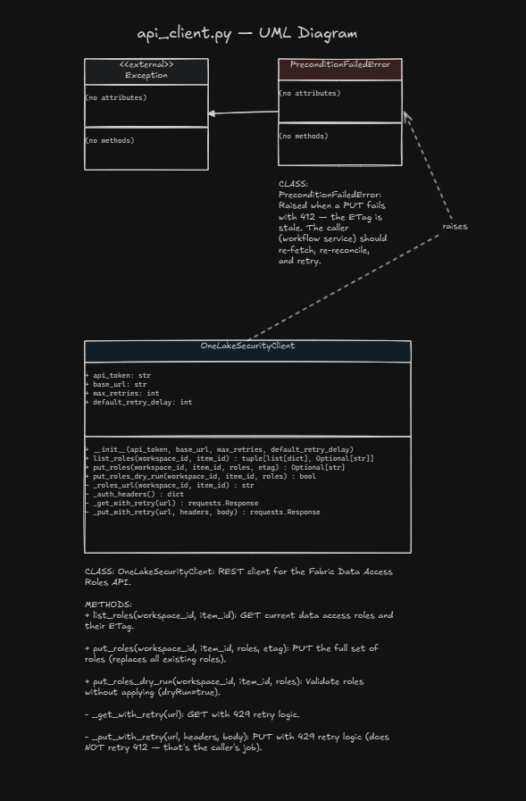
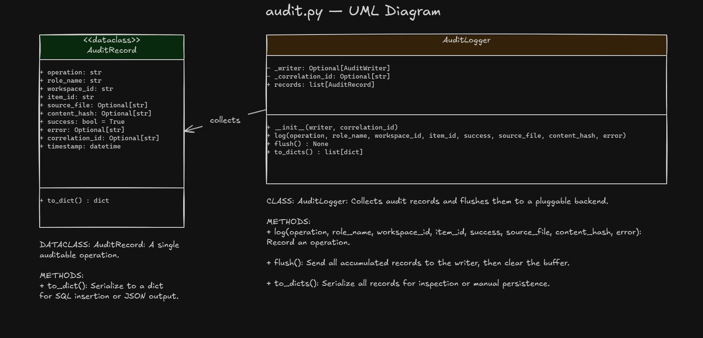
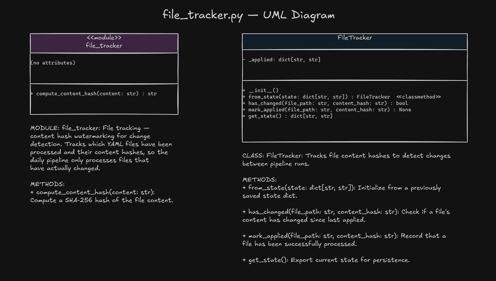
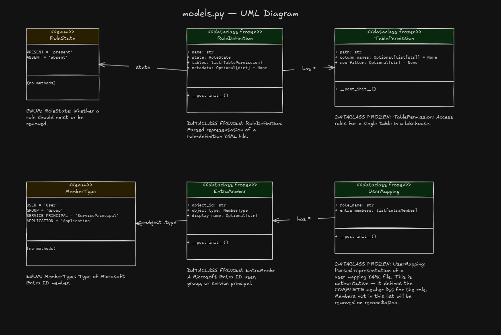
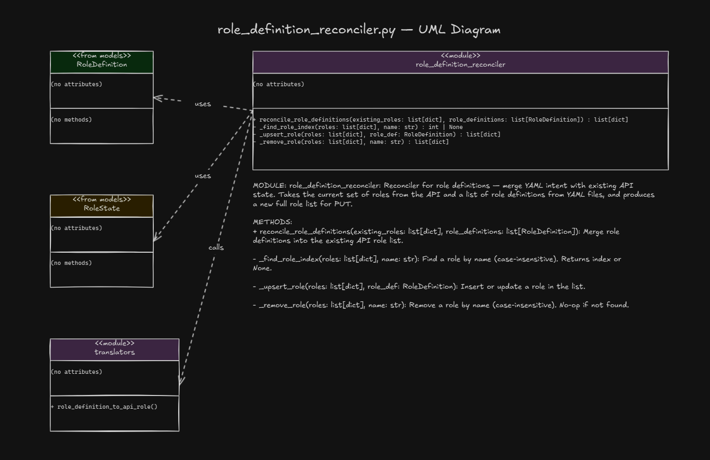
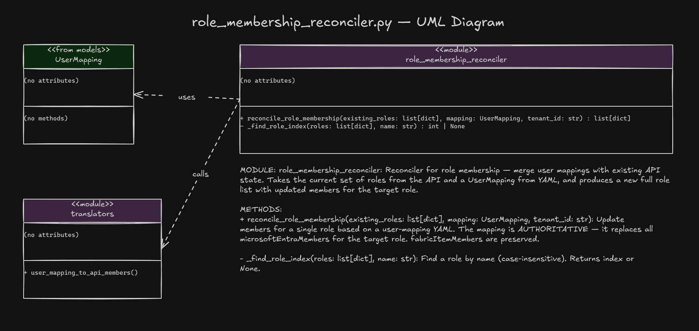
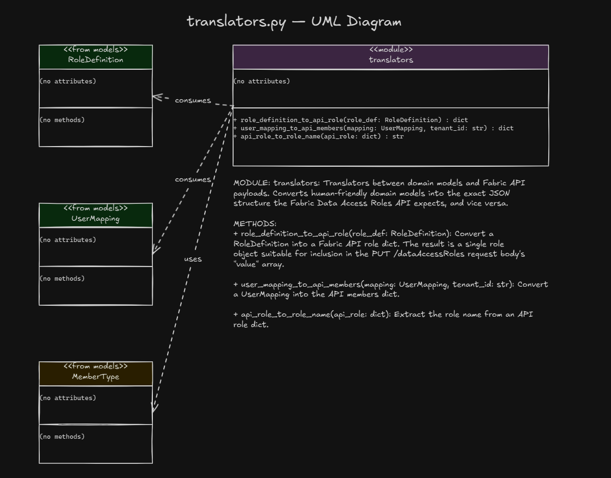
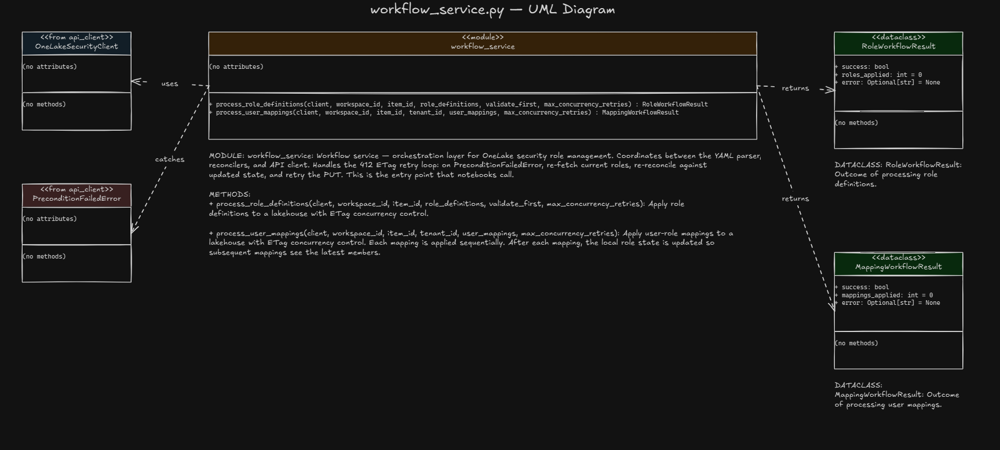
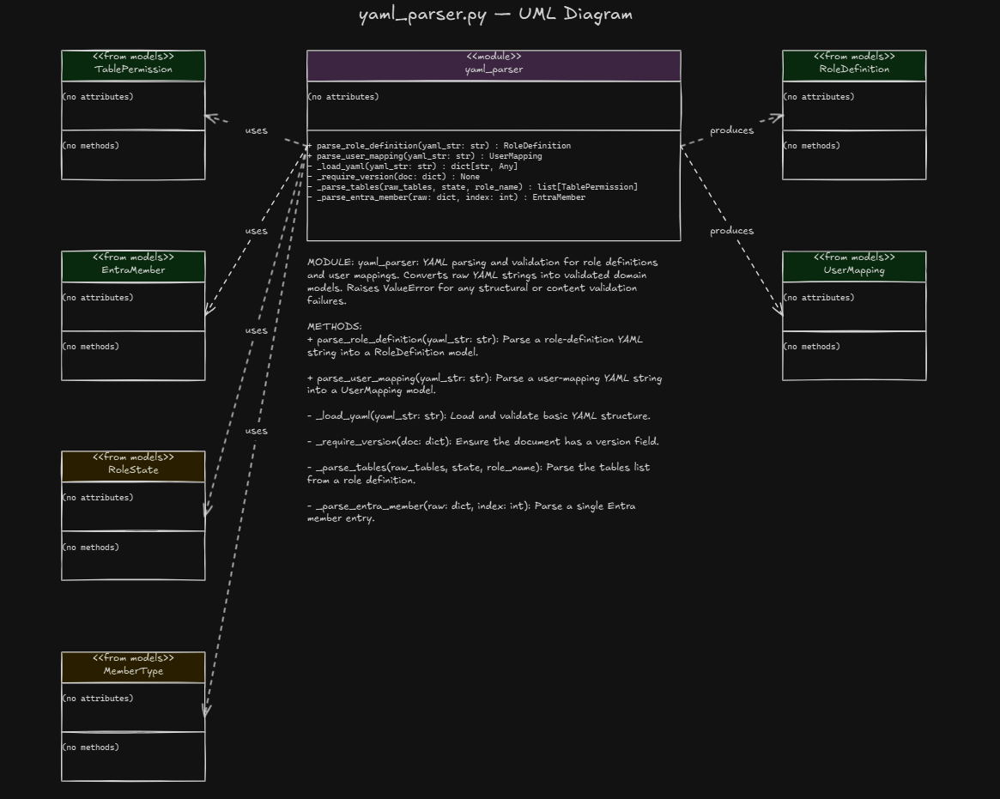

# OneLake Security Role Service

YAML-driven management of OneLake data access roles for Microsoft Fabric lakehouses. Define roles and user mappings as declarative YAML files, drop them in a lakehouse, and a daily pipeline applies them via the Fabric REST API.

## Why This Exists

The Fabric portal lets you create OneLake data access roles manually, but that doesn't scale. When you have dozens of roles across multiple lakehouses, each with RLS, CLS, and specific user assignments, you need:

- **Version-controlled role definitions** (Git, not portal clicks)
- **Auditable user-role mappings** (who has access and when it changed)
- **Idempotent automation** (safe to run daily without side effects)
- **Separation of concerns** (role structure vs. who gets the role)

This service splits the problem into two YAML-driven workflows backed by a shared Python library.

---

## Architecture

```
┌──────────────────────────┐     ┌──────────────────────────┐
│  role-definitions/*.yml  │     │  role-mappings/*.yml      │
│  (what roles look like)  │     │  (who gets each role)     │
└────────────┬─────────────┘     └────────────┬─────────────┘
             │                                │
             ▼                                ▼
┌──────────────────────────┐     ┌──────────────────────────┐
│  Role Creation Notebook  │     │  User Mapping Notebook   │
│  (thin Fabric wrapper)   │     │  (thin Fabric wrapper)   │
└────────────┬─────────────┘     └────────────┬─────────────┘
             │                                │
             ▼                                ▼
┌──────────────────────────────────────────────────────────┐
│              onelake_security Python library              │
│  models · yaml_parser · translators · reconcilers        │
│  api_client · workflow_service · file_tracker · audit    │
└────────────────────────┬─────────────────────────────────┘
                         │
                         ▼
┌──────────────────────────────────────────────────────────┐
│  Fabric REST API                                         │
│  PUT /workspaces/{id}/items/{id}/dataAccessRoles         │
│  (full-set replacement with ETag concurrency)            │
└──────────────────────────────────────────────────────────┘
```

## Package Overview






























### Key Design Decisions

| Decision | Choice | Rationale |
|---|---|---|
| Target lakehouse | Pipeline parameter | Same YAMLs work across DEV/QA/PROD |
| Membership model | Authoritative per file | File IS the complete member list — removes on next run |
| Role deletion | Explicit `state: absent` | Safer than implicit "missing file = delete" |
| Concurrency | ETag / If-Match | Full-set PUT requires optimistic locking |
| Auth | SPN via Azure Key Vault | Existing pattern from the team |
| `fabric_items` | Excluded | `entra_members` is explicit and auditable |

---

## Repository Structure

```
onelake-security-role-service/
├── .cicd/
│   └── onelake-security-role-service-cicd.yml  # CI/CD: test → build → publish to Azure Artifacts
├── src/
│   └── onelake_security/            # Installable Python package (the shared utils library)
│       ├── __init__.py
│       ├── models.py                # Domain models: RoleDefinition, UserMapping, enums
│       ├── yaml_parser.py           # Parse + validate YAML into domain models
│       ├── translators.py           # Convert domain models ↔ Fabric API payloads
│       ├── role_definition_reconciler.py  # Merge role intent with existing API state
│       ├── role_membership_reconciler.py  # Merge member intent with existing API state
│       ├── api_client.py            # REST client with ETag concurrency + 429 retry
│       ├── workflow_service.py      # Orchestration: 412 retry loop, dry-run, coordination
│       ├── file_tracker.py          # Content hash watermarking for change detection
│       ├── audit.py                 # Operation logging with pluggable backend
│       └── lakehouse_audit.py       # Read-only role snapshot of a lakehouse, saveable to disk
├── tests/                           # 159 tests
│   ├── conftest.py                  # Shared fixtures (sample YAMLs, mock API responses)
│   ├── test_models.py
│   ├── test_yaml_parser.py
│   ├── test_translators.py
│   ├── test_reconcilers.py
│   ├── test_api_client.py
│   ├── test_workflow_service.py
│   ├── test_file_tracker.py
│   ├── test_audit.py
│   └── test_lakehouse_audit.py
├── notebooks/                       # Thin Fabric notebook wrappers
│   ├── onelake_role_creation_nb.py
│   ├── onelake_role_mapping_nb.py
│   └── onelake_lakehouse_audit_nb.ipynb  # Read-only full role audit + disk export
├── examples/                        # Working YAML examples
│   ├── role-definitions/
│   │   ├── neurology-read.yml       # Simple RLS
│   │   ├── limited-patient-view.yml # CLS only
│   │   ├── gastroenterology-role.yml# Multi-table RLS + CLS
│   │   ├── data-engineer-full-read.yml  # Wildcard access
│   │   ├── reporting-analyst-schema.yml # Schema-level access
│   │   └── deprecated-legacy-role.yml   # Deletion (state: absent)
│   └── role-mappings/
│       ├── neurology-read-users.yml
│       ├── gastroenterology-users.yml
│       └── data-engineer-users.yml
├── templates/                       # Blank starters for new roles/mappings
│   ├── role-definition-template.yml
│   └── user-mapping-template.yml
├── yaml-schema-reference.yml        # Full annotated schema documentation
├── pyproject.toml                   # Package config (build, deps, pytest)
└── requirements.txt                 # Dependencies for CI
```

---

## YAML Schemas

### Role Definition

```yaml
version: "1.0"
state: present                    # present | absent

role:
  name: NeurologyReadRole
  metadata:
    description: "Filtered access to Neurology data"
    owner: "security-team@contoso.com"
  tables:
    - path: /Tables/doctor_table  # or /Tables/schema/table, /Tables/schema/*, *
      columns:
        names: ["*"]             # specific columns for CLS, or ["*"] / omit for all
      row_filter: "SELECT * FROM doctor_table WHERE department = 'Neurology'"
```

### User-Role Mapping

```yaml
version: "1.0"

mapping:
  role_name: NeurologyReadRole   # must match a role definition
  members:
    entra_members:
      - object_id: "662b14b6-..."
        display_name: "Dr. Klerkx"  # documentation only, not sent to API
        object_type: User            # User | Group | ServicePrincipal | Application
```

See `yaml-schema-reference.yml` for the full annotated schema, `examples/` for working samples, and `templates/` for blank starters.

---

## How It Works at Runtime

### Step 1: User drops YAML files into the lakehouse
```
Lakehouse/Files/role-definitions/neurology-read.yml
Lakehouse/Files/role-mappings/neurology-read-users.yml
```

### Step 2: Daily pipeline runs the notebooks
The pipeline passes target parameters (workspace_id, lakehouse_id, Key Vault config) — these are NOT in the YAML files.

### Step 3: Notebooks call the library
```python
from onelake_security.workflow_service import process_role_definitions

result = process_role_definitions(
    client=client,
    workspace_id=workspace_id,        # from pipeline parameter
    item_id=lakehouse_id,             # from pipeline parameter
    role_definitions=parsed_roles,
    validate_first=True,              # dry-run before applying
)
```

### Step 4: Library handles the hard parts
1. **GET** existing roles + ETag from the API
2. **Reconcile** YAML intent with current state (upsert/delete)
3. **Dry-run** validation (optional)
4. **PUT** new role set with `If-Match` ETag
5. On **412 Precondition Failed**, re-fetch and retry (up to 3 times)
6. **Audit** all operations

---

## Local Development

### Setup
```bash
cd onelake-security-role-service

# Create virtual environment
python -m venv .venv
source .venv/bin/activate       # Linux/Mac
.venv\Scripts\activate          # Windows

# Install package in editable mode with dev dependencies
pip install -e ".[dev]"
```

### Run Tests
```bash
pytest                          # all 137 tests
pytest -v                       # verbose
pytest --cov=onelake_security   # with coverage report
pytest tests/test_models.py     # single module
```

### Build the Wheel
```bash
pip install build
python -m build --wheel
# Output: dist/onelake_security-0.1.0-py3-none-any.whl
```

---

## CI/CD Pipeline

The Azure DevOps pipeline (`.cicd/onelake-security-role-service-cicd.yml`) has two stages:

### Stage 1: Test (every push/PR)
- Installs dependencies from `requirements.txt`
- Runs `pytest` with JUnit XML output and coverage
- Publishes test results and coverage to Azure DevOps
- **Fails the build** if any test fails

### Stage 2: Publish (main branch + manual triggers)
- Builds the `.whl` package
- Authenticates with Azure Artifacts via `TwineAuthenticate`
- Publishes to the `onelake-security-feed` Artifacts feed
- Skips if package version already exists (`--skip-existing`)

### Versioning Strategy

Use semantic versioning with pre-release tags for environment promotion:

| Branch | Version Example | Where It Goes |
|---|---|---|
| `feature/*` | No publish | Tests only |
| `dev` | `0.2.0.dev3` | Dev Fabric Environment |
| `main` | `0.2.0` | Prod Fabric Environment |

**Workflow:**
1. Develop on feature branch → tests run on every push
2. Merge to `dev` → publishes pre-release `.devN` to Artifacts
3. Merge to `main` → publishes stable version to Artifacts
4. Update Fabric Environment to pin the new version → republish Environment

**Version bumping:** Update `version` in `pyproject.toml` and `__init__.py` before merging to main.

---

## Deploying to Fabric

### Option 1: Azure Artifacts Feed → Fabric Environment (Recommended)

This is the automated path — the CI pipeline publishes to Azure Artifacts, and the Fabric Environment pulls from it.

**One-time setup:**

1. **Create an Azure Artifacts Python feed** in your ADO project
2. **Create a Data Factory connection** in Fabric:
   - Settings → Manage connections → New → Cloud → **Azure Artifact Feed (Preview)**
   - Enter the feed URL and a PAT with `Packaging > Read` scope
   - Check "Allow Code-First Artifacts like Notebooks to access this connection"
3. **Configure the Fabric Environment:**
   - Environment → External repositories → Add from private repository
   - Source: pip
   - Library name: `onelake-security`
   - Version: `0.1.0` (or your current version)
4. **Publish** the Environment

**On each update:** Bump the version in `pyproject.toml` → merge to main → pipeline publishes → update version in Fabric Environment → republish.

### Option 2: Manual Upload

1. Build locally: `python -m build --wheel`
2. Fabric Environment → Custom Libraries → upload `dist/onelake_security-0.4.0-py3-none-any.whl`
3. Publish the Environment

---

## Module Reference

| Module | Purpose | Tests |
|---|---|---|
| `models.py` | Enums (`RoleState`, `MemberType`) and frozen dataclasses (`RoleDefinition`, `TablePermission`, `EntraMember`, `UserMapping`) with validation | 26 |
| `yaml_parser.py` | `parse_role_definition()` and `parse_user_mapping()` — YAML string → domain models | 20 |
| `translators.py` | `role_definition_to_api_role()` and `user_mapping_to_api_members()` — domain ↔ API payload | 12 |
| `role_definition_reconciler.py` | `reconcile_role_definitions()` — merge role intent into existing API state (upsert/delete) | 9 |
| `role_membership_reconciler.py` | `reconcile_role_membership()` — replace members for a role, preserve other roles | 8 |
| `api_client.py` | `OneLakeSecurityClient` — GET/PUT roles, workspace role assignments, ETag concurrency and 429 retry | 20 |
| `workflow_service.py` | `process_role_definitions()` and `process_user_mappings()` — orchestration with 412 retry loop | 16 |
| `file_tracker.py` | `FileTracker` and `compute_content_hash()` — SHA-256 watermarking for change detection | 12 |
| `audit.py` | `AuditLogger` and `AuditRecord` — operation logging with pluggable writer backend | 12 |
| `lakehouse_audit.py` | `audit_lakehouse()` and `save_report()` — read-only snapshot of every role on a lakehouse, exportable as JSON/CSV/Markdown | 35 |
| `entra_directory.py` | `EntraDirectoryClient` — resolves member object IDs to Entra display names and types, expands groups to their members, reverse name lookup | 31 |
| `workspace_audit.py` | `audit_workspace_roles()` — read-only snapshot of workspace Admin/Member/Contributor/Viewer grants, with groups expanded to people | 34 |

**Total: 242 tests**

### Auditing a lakehouse

```python
from onelake_security.api_client import OneLakeSecurityClient
from onelake_security.entra_directory import EntraDirectoryClient
from onelake_security.lakehouse_audit import audit_lakehouse, save_report

client = OneLakeSecurityClient(api_token=token)
directory = EntraDirectoryClient(graph_token=graph_token)

report = audit_lakehouse(
    client,
    workspace_id,
    lakehouse_item_id,
    lakehouse_name="clinical_lh",
    directory=directory,     # object IDs -> friendly Entra names
    expand_groups=True,      # groups -> the users inside them
)

print(report.role_count, report.total_members, [r.name for r in report.orphaned_roles])

save_report(report, "audits/clinical_lh.json")                      # full structured snapshot
save_report(report, "audits/clinical_lh.csv", format="csv")         # one row per role/path/member
save_report(report, "audits/clinical_lh.md", format="markdown")     # review-friendly summary
```

### Friendly names instead of object IDs

The Fabric roles API returns member **object IDs only**, so an unenriched audit reads
`ab6dc298-6ad2-449f-944b-e6c1c759e586 | n/a`. `entra_directory` maps those GUIDs back to the
security group or user behind them.

```python
from onelake_security.entra_directory import EntraDirectoryClient
from onelake_security.lakehouse_audit import resolve_member_names, expand_group_members

directory = EntraDirectoryClient(graph_token=graph_token)

# Object ID -> display name, object type, UPN. Returns the IDs that failed, with reasons.
unresolved = resolve_member_names(report, directory)
for item in unresolved:
    print(item.object_id, item.reason)   # deleted / cross-tenant / not visible

# Group -> the principals inside it, so the audit shows who actually holds access.
expand_group_members(report, directory)          # transitive by default

# Ad hoc lookups
directory.resolve_object("ab6dc298-6ad2-449f-944b-e6c1c759e586")   # -> DirectoryObject
directory.get_group_members(group_id)                              # -> [DirectoryObject]
directory.find_by_name("AAD-NEUROLOGY-READERS")                    # name -> object IDs
```

| Capability | Method | Notes |
|---|---|---|
| Bulk resolve | `resolve_objects()` / `resolve()` | Batched 1000/call; `resolve()` also returns *why* an ID failed |
| Single resolve | `resolve_object()` | Returns `None` when the object is not visible |
| Group expansion | `get_group_members()` | `transitive=True` flattens nested groups to end principals |
| Reverse lookup | `find_by_name()` | Searches users, groups, and service principals |
| Caching | on by default | Repeated group hits across roles collapse to one Graph call |

After enrichment the report exposes `member.friendly_name`, `member.object_type`,
`member.user_principal_name`, `member.group_members`, and `member.resolution_note`;
`report.to_effective_user_rows()` gives one row per role × path × **person** with groups expanded.

**Graph permissions:** the SPN needs `Directory.Read.All` (or `User.Read.All` + `Group.Read.All`),
plus `GroupMember.Read.All` for group expansion. Without them the audit still succeeds — members
simply keep their object IDs and carry a `resolution_note` explaining why.

### Auditing workspace roles

OneLake data access roles govern tables, columns, and rows *inside* a lakehouse. Workspace roles
are the plane above: a workspace **Admin** outranks every OneLake role, so a review that only
reads `dataAccessRoles` misses the broadest access in the tenant.

```python
from onelake_security.workspace_audit import audit_workspace_roles, save_workspace_report

report = audit_workspace_roles(
    client,
    workspace_id,
    directory=directory,   # expands security groups to the people inside them
)

print(report.assignment_count, report.role_counts)
print([a.friendly_name for a in report.elevated_assignments])   # Admin + Member
print([a.friendly_name for a in report.empty_groups])           # grants that reach nobody

for row in report.effective_principals():
    print(row["effective_role"], row["principal_name"], row["granted_via"])

save_workspace_report(report, "audits/ws.json")
save_workspace_report(report, "audits/ws.csv", format="csv")
save_workspace_report(report, "audits/ws_effective.csv", format="effective_csv")
save_workspace_report(report, "audits/ws.md", format="markdown")
```

`effective_principals()` collapses every grant to **one row per person at their highest role**.
A user who is a direct Viewer but also sits in an Admin group is reported once, as Admin, with
`granted_via` listing both paths.

| Property | Meaning |
|---|---|
| `role_counts` | `{"Admin": 6, "Member": 1, "Contributor": 2, "Viewer": 4}` |
| `elevated_assignments` | Admin + Member grants — the ones worth challenging |
| `group_assignments` | Grants made to a security group rather than a person |
| `empty_groups` | Groups that were expanded and contain nobody — the grant is inert |
| `unexpanded_groups` | Groups whose membership was never looked up (unknown, not empty) |

**Permissions:** reading `GET /workspaces/{id}/roleAssignments` requires the SPN to hold
**Contributor or higher** on that workspace, in addition to the Graph permissions above.

**Deployed notebook:** `onelake_lakehouse_audit_nb` in workspace `a8cbda3d-903e-4154-97d9-9a91c95abb42`, folder *OneLake Security Audit*. It audits lakehouse `0386880f-c134-41be-923c-00150c5fbafe`, resolves every member object ID to its Entra display name and expands groups to the users inside them, displays a role summary, a role × path × member detail grid, an effective-access grid (one row per person), **a workspace role audit for the workspace the notebook is running in** (section 6, with a per-user effective-access grid), governance findings (orphaned roles, wildcard grants, unresolved members, empty group grants, RLS/CLS coverage), and writes timestamped plus `_latest` JSON/CSV/Markdown files — including `effective_access.csv` and `workspace_roles.*` — to `Files/onelake-security-audits`.

In Spark, `save_report()` targets a local filesystem path — write to OneLake with `notebookutils.fs.put` instead:

```python
notebookutils.fs.put(f"{abfss_dir}/audit.json", report.to_json(), True)
notebookutils.fs.put(f"{abfss_dir}/audit.md", report.to_markdown(), True)
```

---

## Prerequisites

- **SPN with `OneLake.ReadWrite.All`** scope and **Contributor** role on the target workspace (Contributor or higher is also what lets the workspace role audit read `GET /workspaces/{id}/roleAssignments`)
- **Microsoft Graph application permissions** for friendly-name resolution in audits: `Directory.Read.All` (or `User.Read.All` + `Group.Read.All`), plus `GroupMember.Read.All` to expand groups — admin consent required
- **OneLake Security must be enabled** on the target lakehouse (manual, one-time, by the lakehouse owner)
- **Azure Key Vault** with SPN credentials stored as secrets
- **Fabric Environment** with `onelake-security` package installed

---

## API Reference

This service uses the [OneLake Data Access Security API](https://learn.microsoft.com/en-us/rest/api/fabric/core/onelake-data-access-security/create-or-update-data-access-roles) (Preview).

Key behaviors:
- **PUT replaces ALL roles** on an item — you must GET first, merge, then PUT the full set
- **ETag concurrency** — use `If-Match` header to prevent overwrites from concurrent modifications
- **`dryRun=true`** query parameter validates without applying
- **429 rate limiting** — respect `Retry-After` header
