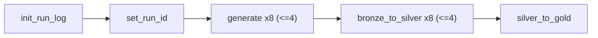

# synthea-data-airflow-ws

Managed-Airflow encapsulation of the Synthea medallion pipeline, following
**Option B (pool-per-job)** from
[`.local/spark-metadata-driven-framework.md`](../.local/spark-metadata-driven-framework.md).

The **entire** Synthea bronze→silver→gold pipeline (originally the
`synthea_full_run` Fabric **Data Pipeline** in `synthea-data-ws`) is treated as
**one end-to-end job** that runs on **one Custom Live Pool** sized to **60% of an
F64** capacity. Airflow replaces the pipeline's orchestration; the five Fabric
notebooks do the work unchanged.

> Full rationale and design decisions:
> [`synthea-data-airflow-ws-design-approach.md`](./synthea-data-airflow-ws-design-approach.md).

---

## What's here

```
synthea-data-airflow-ws/
├─ synthea-data-airflow-ws-design-approach.md   Design doc (reviewed/approved)
├─ README.md                                     This file
├─ dags/
│  └─ synthea_full_run.py                        The Airflow DAG (Option B)
├─ sql/
│  └─ control_run_state.sql                      DDL for gold.control.run_state
└─ include/
   └─ run_state_helpers.py                       Paste-in skip/restart helpers
```

The five Fabric notebooks (`00_run_log_init`, `01_synthea_generate`,
`02_bronze_to_silver`, `03_silver_to_gold`, `99_notebook_timing_report`) live in
the Fabric workspace and are referenced by **item ID** from the DAG.

---

## The DAG at a glance



| Task | Notebook | Grain | Timeout / Retry |
|---|---|---|---|
| `init_run_log` | `00_run_log_init` | once (guarded) | 30m / 1 |
| `set_run_id` | — (PythonOperator) | once | — |
| `generate` | `01_synthea_generate` | 8 cohorts, ≤4 concurrent | 12h / 1 |
| `bronze_to_silver` | `02_bronze_to_silver` | 8 cohorts, ≤4 concurrent | 6h / 1 |
| `silver_to_gold` | `03_silver_to_gold` | once | 4h / 1 |

The `generate >> bronze_to_silver` edge preserves the source **stage-gate** (all
generate finishes before any bronze→silver). Cohort fan-out uses Airflow
**dynamic task mapping** (`.expand`), the native replacement for the source
`ForEach` activities.

---

## Two ceilings — don't confuse them

| Control | What it is | Caps |
|---|---|---|
| **Custom Live Pool** `synthea_pool_60` | Fabric Spark compute, bound to an Environment | The **capacity** ceiling (~60% of F64) |
| **Airflow Pool** `synthea_60` (4 slots) | Airflow scheduler concurrency | How many **cohort tasks** run at once (mirrors `batchCount=4`) |

### Capacity sizing — F64 @ 60%

| Step | Decision | Result |
|---|---|---|
| Capacity → Spark vCores | F64 ≈ 128 base (verify under *Capacity settings → Spark*) | 128 |
| Take 60% | `0.60 × 128` | ~77 vCores pool budget |
| Node size → max nodes | Medium (8 vCores) → `77 ÷ 8` | pool max ~10 nodes |
| Fan-out width | mirror `batchCount=4` via the Airflow pool | 4 cohorts concurrent |

Because this is the **only** job in the workspace, its pool gets the **full**
60%. If you add a second concurrently-active job later, the pools must **sum** to
the budget (e.g. 30% + 30%) or be staggered.

---

## Idempotency & skip/restart

Two layers, both preserved/added:

1. **`run_id` contract (unchanged):** `run_id = run_id_root + '-' + dataset_id`.
   Generate writes `Files/raw/<dataset_id>/<run_id>/...`; bronze→silver MERGEs
   that path into `silver.core.*`; gold fully overwrites `exec.*` and
   `insights.daily_anomalies`.
2. **`gold.control.run_state` (new):** each stage notebook records
   `RUNNING → SUCCEEDED/FAILED` per `(run_id_root, cohort_id, stage)` and
   self-skips a triple that already `SUCCEEDED`. Re-triggering the DAG with the
   **same** `run_id_root` (Airflow re-run / clear) replays only failed cohorts; a
   **new** `run_id_root` forces a clean full run.

Wire it up by:
- adding `sql/control_run_state.sql` to `00_run_log_init`, and
- pasting `include/run_state_helpers.py` into the three stage notebooks (see that
  file's docstring for the top-of-notebook pattern).

The DAG passes `run_id_root`, the cohort fields, and `stage` into each notebook's
`parameters`-tagged cell — that is the contract the helpers rely on.

---

## Deploy

1. **Fill in the IDs** in `dags/synthea_full_run.py`: `WORKSPACE_ID` and the four
   notebook item IDs.
2. **Notebooks:** apply `sql/control_run_state.sql` to `00_run_log_init`; paste
   `include/run_state_helpers.py` into the three stage notebooks; ensure each has
   a `parameters` cell accepting `run_id_root`, the cohort fields, and `stage`.
3. **Point the Apache Airflow Job** at `dags/` (Git integration recommended).

### Prerequisites (one-time)

1. Tenant setting **"Service principals can call Fabric public APIs"** = enabled.
2. A **service principal** added as **Contributor** on `synthea-data-airflow-ws`.
3. Airflow connection **`fabric_conn`** (Tenant ID / Client ID / Client secret;
   Endpoint `https://api.fabric.microsoft.com`).
4. **Custom Live Pool** `synthea_pool_60` (max ~10 Medium nodes) created and
   bound to the Environment the notebooks target.
5. **Airflow Pool** `synthea_60` created with **4 slots**
   (*Admin → Pools* in the Airflow UI).
6. (Optional) "Enable triggers" on the Environment — only if you switch the
   operators to `deferrable=True`.

---

## Known gaps carried forward (out of scope)

Faithfully inherited from `synthea-data-ws`, **not** fixed by this port:

- **FHIR generated but unused** — `ehr_fhir` produces no silver rows.
- **`exec.quality_measures`** emits only `cohort_id="ALL"`.
- **No semantic model / report yet** — so there is no Direct Lake `reframe` task
  at the end of the DAG (unlike the `medallion_nyc_taxi` reference DAG). Easy to
  add once a model exists.
