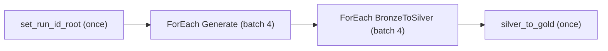
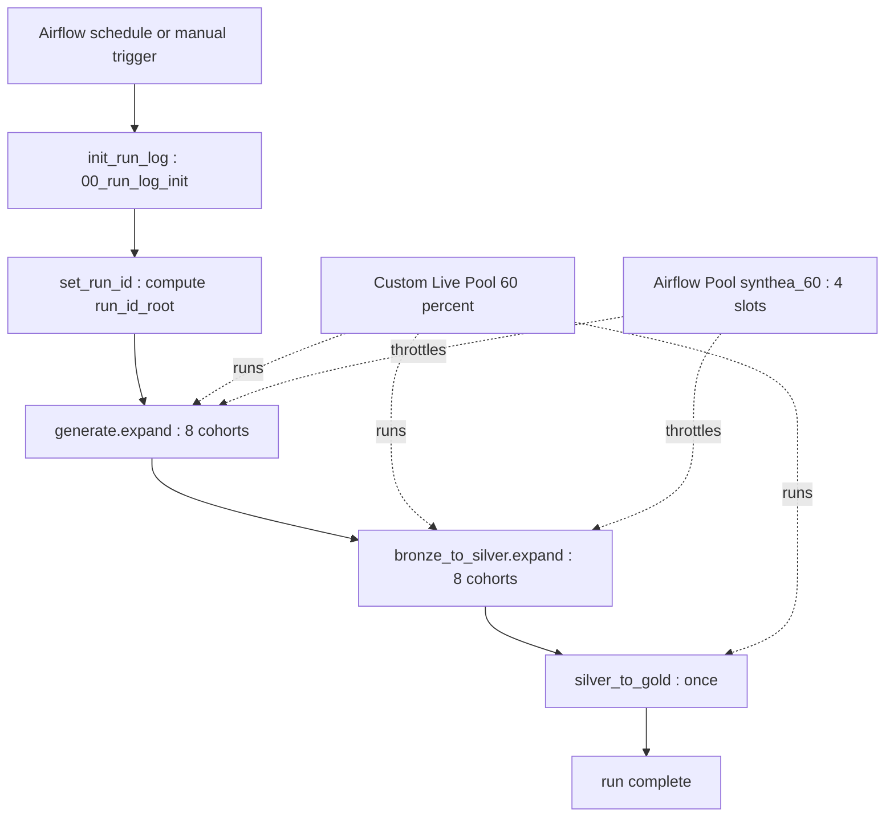
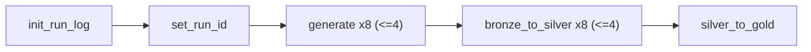

# Synthea Data — Airflow Workspace Design Approach

> **Status:** Design proposal for review. **No implementation until approved.**
> **Decisions locked with the reviewer:**
> - **Architecture:** Option B (pool-per-job) from `.local/spark-metadata-driven-framework.md`. The **entire existing `synthea-data-ws` pipeline is treated as ONE end-to-end job** → **one Custom Live Pool**.
> - **Capacity target:** **F64 @ 60%** (worked example for pool sizing).
> - **Port fidelity:** **Faithful 1:1 port + light Option-B enhancements** — reuse the 5 existing notebooks and the existing `run_id` idempotency; *additionally* wire in `00_run_log_init` as a guarded first task and add a small `control.run_state` table for per-cohort skip/restart.

---

## Table of Contents

1. [What this is (and isn't)](#1-what-this-is-and-isnt)
2. [Source pipeline recap — what we are porting](#2-source-pipeline-recap--what-we-are-porting)
3. [Why Option B for this workload](#3-why-option-b-for-this-workload)
4. [Target architecture](#4-target-architecture)
5. [Capacity & pool sizing — F64 @ 60% worked example](#5-capacity--pool-sizing--f64--60-worked-example)
6. [The Airflow DAG design](#6-the-airflow-dag-design)
7. [Idempotency, skip/restart & the `control.run_state` table](#7-idempotency-skiprestart--the-controlrun_state-table)
8. [Notebook inventory & the parameter contract](#8-notebook-inventory--the-parameter-contract)
9. [Lakehouses & data model (unchanged)](#9-lakehouses--data-model-unchanged)
10. [Prerequisites & one-time setup](#10-prerequisites--one-time-setup)
11. [Known gaps carried forward (out of scope)](#11-known-gaps-carried-forward-out-of-scope)
12. [Proposed repository layout](#12-proposed-repository-layout)
13. [Phased delivery plan](#13-phased-delivery-plan)
14. [Open items for reviewer](#14-open-items-for-reviewer)

---

## 1. What this is (and isn't)

**The "port" is an orchestration swap.** We re-create the *sequencing and fan-out* of the existing `synthea_full_run` **Fabric Data Pipeline** as a **Managed Airflow DAG**. The *work itself* — the 5 notebooks, 3 lakehouses, 8 cohorts, and the medallion logic — is reused as-is.

| | Today (`synthea-data-ws`) | After the port (`synthea-data-airflow-ws`) |
|---|---|---|
| Orchestrator | Fabric Data Pipeline | Managed Airflow DAG |
| "Run once" step | `SetVariable` (`run_id_root`) | `set_run_id` PythonOperator (XCom) |
| Fan-out | `ForEach` (batchCount=4) | Dynamic task mapping `.expand()` + Airflow Pool |
| Notebook call | Pipeline notebook activity | `FabricRunItemOperator` (`job_type="RunNotebook"`) |
| Capacity control | implicit / shared | **one Custom Live Pool** sized to 60% |
| Idempotency | `run_id` MERGE + gold overwrite | same **+** `control.run_state` skip/restart |

**Not in scope:** changing medallion logic, fixing the FHIR/quality-measure gaps, or building a semantic model (see [§11](#11-known-gaps-carried-forward-out-of-scope)).

---

## 2. Source pipeline recap — what we are porting

The existing `synthea_full_run` pipeline runs four stages over **8 cohorts** (~250K patients):



| Stage | Activity | Grain | Concurrency | Timeout / Retry |
|---|---|---|---|---|
| 1 | `set_run_id_root` (SetVariable) | once | — | — |
| 2 | `01_synthea_generate` | per cohort | ForEach batch 4 | 12h / retry 1 |
| 3 | `02_bronze_to_silver` | per cohort | ForEach batch 4 | 6h / retry 1 |
| 4 | `03_silver_to_gold` | once (after all silver) | — | 4h / retry 1 |

**The idempotency contract** (must be preserved):
`run_id = run_id_root + '-' + dataset_id`. Generate lands raw files under `Files/raw/.../<run_id>/`; bronze→silver reads that exact path and `MERGE`s into `silver.core.*`; gold fully overwrites `exec.*` and `insights.daily_anomalies`.

**The 8 cohorts** drive the fan-out: `ma_diabetes` (50k), `oncology` (25k), `claims_cpcds` (50k), `ehr_fhir` (5k), `sdoh` (25k), `houston_geo` (40k, TX), `provider_directory` (500), `covid_national` (55k). Cohort isolation is by `cohort_id` (= `dataset_id`).

> **Stage-gate is faithful:** the source runs *all* generate, *then* all bronze→silver, *then* gold (two separate `ForEach` activities in sequence). The Airflow design keeps this gate (see [§6](#6-the-airflow-dag-design)).

---

## 3. Why Option B for this workload

Option B says: **one end-to-end job → one Custom Live Pool, sized to its slice of the budget.** Because we are encapsulating the *whole* synthea pipeline as a single job, this is the natural fit:

- **Everything in the job is related.** All 8 cohorts share the same notebooks, lakehouses, and medallion logic — exactly the "related work" Option B is designed for. There is **no cross-job dispatcher/registry** to build (that was Option A's complexity).
- **Isolation is the pool boundary.** This job cannot starve any other job because its pool is capped; other jobs get their own pools.
- **The one hard rule:** *concurrently-active* Custom Live Pools must **sum** to ≤ the budget. Since this is the only job in `synthea-data-airflow-ws`, its pool gets the **full 60%**. If you later add a second concurrent job, you must re-split (e.g., 30% + 30%) or stagger start times.

---

## 4. Target architecture



Two distinct "pools" do two different jobs — do not confuse them:

| Control | What it is | What it caps |
|---|---|---|
| **Custom Live Pool** (`synthea_pool_60`) | Fabric Spark compute, bound to an **Environment** | The **capacity ceiling** (the 60% of F64) |
| **Airflow Pool** (`synthea_60`, 4 slots) | Airflow scheduler concurrency | How many **cohort tasks run at once** (mirrors batchCount=4) |

The Custom Live Pool guarantees the job never exceeds 60% of capacity; the Airflow Pool keeps the fan-out from launching all 8 cohorts simultaneously.

---

## 5. Capacity & pool sizing — F64 @ 60% worked example

Following the sizing chain in `.local/fabric-orchestration-overview.md` §7.8, adapted from "100 tables" to **8 cohorts**:

| Step | Decision | Result |
|---|---|---|
| 1. Capacity → total Spark vCores | F64 ≈ **128** base Spark vCores (verify under *Capacity settings → Spark*) | 128 vCores |
| 2. Take 60% → size the pool | `0.60 × 128` | **~77 vCores** pool budget |
| 3. Pick node size → max nodes | Medium (8 vCores/node) → `77 ÷ 8` | pool **max ~10 nodes** (the hard 60% ceiling) |
| 4. Fan-out width | mirror existing `batchCount=4` via Airflow Pool | **4 cohorts concurrent** |
| 5. Per-cohort footprint | `77 vCores ÷ 4 lanes` | **~19 vCores/cohort** headroom |

**Why 4 concurrent and not more:** the source pipeline already tuned to `batchCount=4`. With only 8 cohorts, 4 lanes drains the queue in two waves while leaving each cohort ~19 vCores — comfortable for both the driver-bound generate step and the executor-bound MERGE step. The pool's `max ~10 nodes` is the *physical* 60% ceiling; the Airflow Pool's 4 slots is the *logical* throttle underneath it.

**Stage-specific note:**
- **Generate** runs the Synthea JAR via subprocess **in the driver** — it is driver-CPU + local-disk heavy, light on executors. 4 concurrent driver-heavy sessions fit well within 10 nodes.
- **Bronze→silver** is executor-heavy Spark `MERGE`. Optional density lever (not required at this scale): pack cohorts onto shared **HC Livy sessions** via a common `sessionTag` (≤5 REPLs/session) — see overview §4. With only 8 cohorts this is optional; per-task sessions are simplest.

---

## 6. The Airflow DAG design

**DAG id:** `synthea_full_run` · **schedule:** configurable (default manual/`None`, with a daily cron option) · **pool:** `synthea_60`.

Tasks (all notebook tasks use `FabricRunItemOperator`, `job_type="RunNotebook"`, `wait_for_termination=True`, following the `.local/medallion_pipeline.py` pattern):

1. **`init_run_log`** → runs `00_run_log_init`. Idempotent `CREATE TABLE IF NOT EXISTS gold.agent.run_log` (and `gold.control.run_state`). Safe no-op on re-runs. *This wires in the previously-orphaned init notebook.*
2. **`set_run_id`** (PythonOperator) → `run_id_root = utcnow("yyyyMMddHHmmss")`, pushed to XCom. Replaces the `SetVariable` activity.
3. **`generate`** → `FabricRunItemOperator.partial(item_id=GENERATE_NB, pool="synthea_60", retries=1, execution_timeout=12h).expand(cohort=COHORTS)` — **8 mapped tasks**, ≤4 concurrent. Each passes `run_id_root` + the cohort's params.
4. **`bronze_to_silver`** → same `.expand(cohort=COHORTS)` pattern, `retries=1`, `timeout=6h`. Depends on `generate` (stage-gate: all generate complete first — faithful to the source).
5. **`silver_to_gold`** → single `FabricRunItemOperator`, `retries=1`, `timeout=4h`. Runs after all `bronze_to_silver` mapped tasks succeed.



**What dynamic task mapping buys us over `ForEach`:**
- **One visible, independently-retryable task per cohort** (not a hidden loop) — per-cohort logs, per-cohort retry, per-cohort skip.
- The Airflow Pool frees the worker slot while polling, so 4 slots genuinely means 4 in-flight cohorts.
- Adding/removing a cohort = editing the `COHORTS` list; no DAG rewrite.

---

## 7. Idempotency, skip/restart & the `control.run_state` table

The existing `run_id` contract is **kept unchanged** (`run_id = run_id_root + '-' + dataset_id`; generate writes the path, bronze→silver MERGEs it, gold overwrites). On top of it we add **per-cohort skip/restart**, which is the light Option-B enhancement.

**New table — `gold.control.run_state`:**

| Column | Purpose |
|---|---|
| `run_id_root` | the run grouping key |
| `cohort_id` | cohort (= dataset_id) |
| `stage` | `generate` \| `bronze_to_silver` \| `silver_to_gold` |
| `status` | `RUNNING` \| `SUCCEEDED` \| `FAILED` |
| `started_ts`, `ended_ts`, `attempt`, `error` | observability |

**How it works:**
- Each notebook **UPSERTs** `RUNNING` on entry and `SUCCEEDED`/`FAILED` on exit for its `(run_id_root, cohort_id, stage)`.
- A lightweight **guard at task start** checks `run_state`; if that triple is already `SUCCEEDED`, it raises `AirflowSkipException` and the cohort is skipped.
- **Result:** re-triggering the DAG with the **same `run_id_root`** (Airflow re-run / clear) replays only the cohorts that failed; completed cohorts skip instantly. A **new** `run_id_root` forces a clean full run.

This gives cheap restartability without changing any medallion logic.

---

## 8. Notebook inventory & the parameter contract

All 5 notebooks are **reused**. Changes are additive only (UPSERT into `run_state`, read a `parameters` cell).

| Notebook | Role | Port change |
|---|---|---|
| `00_run_log_init` | create `agent.run_log` (+ `control.run_state`) | **wired in** as `init_run_log` task; add `run_state` DDL |
| `01_synthea_generate` | Synthea JAR → bronze raw files | add `run_state` UPSERT; read `run_id_root`,`cohort` params |
| `02_bronze_to_silver` | MERGE 18 CSVs → `silver.core.*` | add `run_state` UPSERT + skip guard |
| `03_silver_to_gold` | overwrite `exec.*` + `insights.daily_anomalies` | add `run_state` UPSERT |
| `99_notebook_timing_report` | ad-hoc perf (Fabric REST) | **unchanged**, stays out of the DAG |

**Parameter contract (Fabric `parameters`-tagged cell):** every stage notebook accepts `run_id_root` (string) and `cohort` (the cohort dict / `dataset_id`). The DAG injects these per mapped task. This is what lets one parameterized notebook serve all 8 cohorts.

---

## 9. Lakehouses & data model (unchanged)

The 3 schema-enabled lakehouses are reused exactly:

- **`lh_synthea_bronze`** — `Files/raw/<dataset_id>/<run_id>/...` landing + `_bin` JAR cache.
- **`lh_synthea_silver`** — `core.*` (18 typed Delta tables; governance cols `cohort_id, run_id, load_ts, source_file`; MERGE on natural keys).
- **`lh_synthea_gold`** — `exec.*` marts, `insights.daily_anomalies`, `agent.run_log`, **+ new `control.run_state`**; full overwrite; keyed `(date, cohort_id)`.

> **Cross-lakehouse access quirk preserved:** `02_bronze_to_silver` reads bronze via the explicit ABFSS path (`abfss://synthea-data-airflow-ws@onelake.dfs.fabric.microsoft.com/lh_synthea_bronze.Lakehouse/Files/raw/<dataset_id>/<run_id>/csv`), not the attached default lakehouse. Silver/gold use the attached default LH + 3-part names → all three lakehouses remain **schema-enabled**.

---

## 10. Prerequisites & one-time setup

From `.local/medallion_pipeline.py` header + overview §10:

1. Tenant setting **"Service principals can call Fabric public APIs"** = enabled.
2. A **service principal** added as **Contributor** on `synthea-data-airflow-ws`.
3. Airflow connection **`fabric_conn`** holding SP Tenant/Client ID + secret.
4. **Custom Live Pool** `synthea_pool_60` created (max ~10 Medium nodes) and bound to an **Environment** the notebooks/DAG target.
5. **Airflow Pool** `synthea_60` created with **4 slots**.
6. The 3 lakehouses + 5 notebooks present in the new workspace (copied/recreated from `synthea-data-ws`).

---

## 11. Known gaps carried forward (out of scope)

These exist in the source and are **not** fixed by this port (the reviewer chose "faithful + light enhancements," not "fix gaps"):

- **FHIR generated but unused** — `ehr_fhir` produces FHIR output that no silver step consumes (so that cohort yields no silver rows). Carried as-is.
- **`exec.quality_measures` emits only `cohort_id="ALL"`** — not per-cohort. Carried as-is.
- **No semantic model / Direct Lake report yet** — so there is **no reframe task** in the DAG (unlike `medallion_pipeline.py`). Easy to add later once a model exists.

---

## 12. Proposed repository layout

```
synthea-data-airflow-ws/
├─ synthea-data-airflow-ws-design-approach.md   (this doc)
├─ README.md                                     (workspace overview — Phase 7)
├─ dags/
│  └─ synthea_full_run.py                        (the Airflow DAG)
└─ notebooks/                                    (ported, parameterized)
   ├─ 00_run_log_init.ipynb
   ├─ 01_synthea_generate.ipynb
   ├─ 02_bronze_to_silver.ipynb
   ├─ 03_silver_to_gold.ipynb
   └─ 99_notebook_timing_report.ipynb
```

---

## 13. Phased delivery plan

| Phase | Deliverable |
|---|---|
| **1. Capacity & pools** | Create `synthea_pool_60` Custom Live Pool (F64@60% → ~10 Medium nodes) + Environment binding; create Airflow Pool `synthea_60` (4 slots). |
| **2. Auth & prereqs** | SP + Contributor role + tenant settings + `fabric_conn` connection. |
| **3. Control plane** | Add `gold.control.run_state` DDL to `00_run_log_init`. |
| **4. Notebook port** | Bring the 5 notebooks into the workspace; add the `parameters` cell + `run_state` UPSERT/guard. |
| **5. DAG authoring** | Write `dags/synthea_full_run.py` (`set_run_id`, `init_run_log`, `generate.expand`, `bronze_to_silver.expand`, `silver_to_gold`) with pool + skip guards. |
| **6. Validation** | Single-cohort dry run → full 8-cohort run; confirm capacity stays ≤60%; test skip/restart with a forced cohort failure. |
| **7. Docs** | Workspace `README.md`. |

---

## 14. Open items for reviewer

1. **Schedule:** default to **manual/on-demand** (matches the source), or set a daily cron (e.g., `0 6 * * *`)?
2. **Notebook source of truth:** copy the notebooks into `synthea-data-airflow-ws/notebooks/` for version control, or reference the live workspace items by `item_id` only?
3. **`deferrable` operators:** keep `deferrable=False` (no extra setup, simplest) or enable triggers to free worker slots during long generate runs?
4. **Node size:** Medium (8 vCores) as assumed, or Small/Large depending on what *Capacity settings → Spark* actually exposes on your F64?
