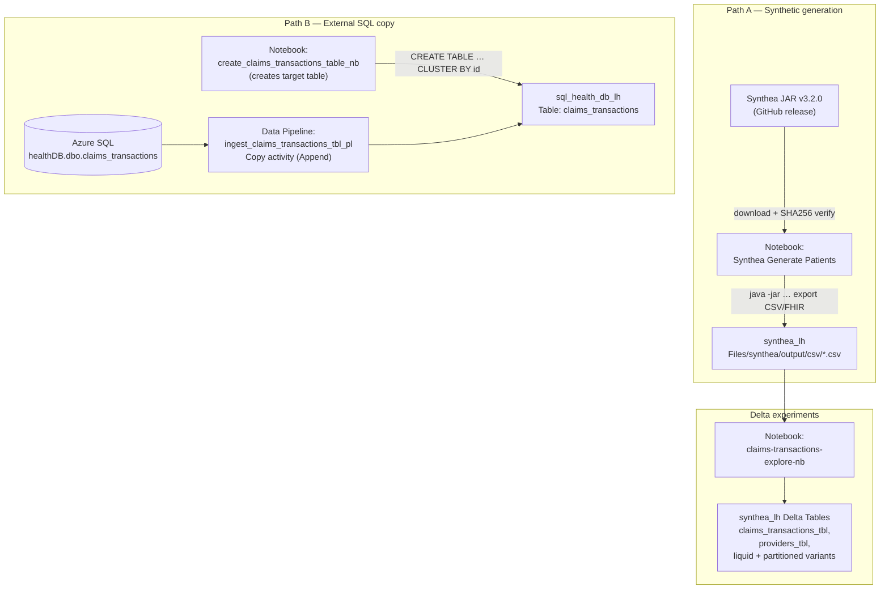
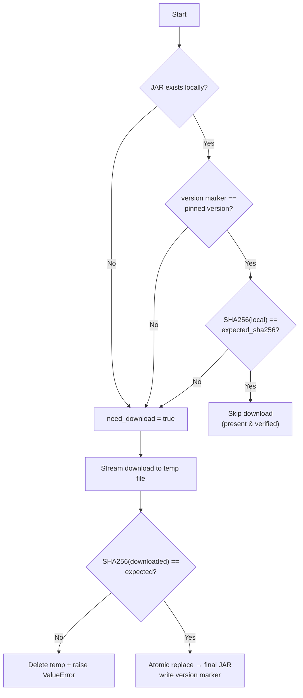
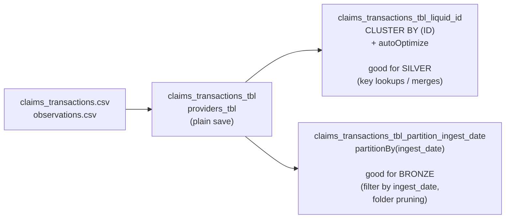
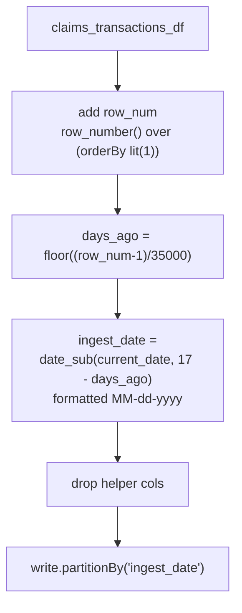
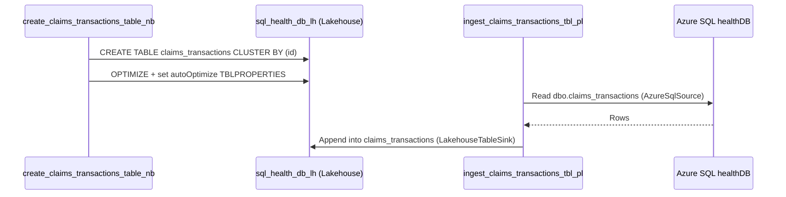
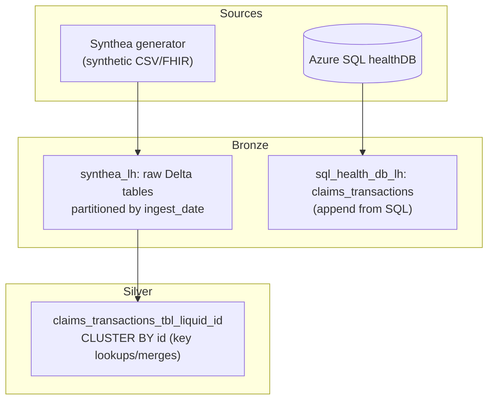

# Synthea — Synthetic Health Data (Fabric workspace notes)

These notes document everything in the Fabric folder
`fabric_items/Synthea - Synthetic Health Data/`. The folder demonstrates two
independent ways of landing healthcare claims data into Microsoft Fabric
lakehouses, plus a set of Delta Lake table‑optimization experiments
(liquid clustering vs. partitioning) using [Synthea](https://github.com/synthetichealth/synthea)
synthetic patient data.

> **Synthea** is an open‑source synthetic patient generator. It produces
> realistic — but completely fake — health records (patients, encounters,
> claims, observations, providers, etc.) with no privacy concerns, which makes
> it ideal for demos and engineering experiments.

---

## 1. Inventory of Fabric items

| Item | Type | Default lakehouse | Purpose |
|------|------|-------------------|---------|
| `synthea_lh` | Lakehouse | — | Stores the raw Synthea generator output (`Files/synthea/...`) and the Delta tables built from it. |
| `sql_health_db_lh` | Lakehouse | — | Target for claims copied from an external Azure SQL database (`healthDB`). |
| `Synthea Generate Patients` | Notebook | `synthea_lh` | Downloads the pinned Synthea JAR (integrity‑checked) and runs it to generate synthetic CSV/FHIR data. |
| `claims-transactions-explore-nb` | Notebook | `synthea_lh` | Reads the generated CSVs, lands them as Delta tables, and runs liquid‑clustering / partitioning experiments. |
| `create_claims_transactions_table_nb` | Notebook | `sql_health_db_lh` | Pre‑creates the managed `claims_transactions` Delta table (clustered by `id`) for the pipeline to append into. |
| `ingest_claims_transactions_tbl_pl` | Data Pipeline | — | Copy activity: Azure SQL `healthDB.dbo.claims_transactions` → lakehouse table `claims_transactions` (Append). |

Workspace ID referenced throughout: `a8cbda3d-903e-4154-97d9-9a91c95abb42`.

---

## 2. High‑level architecture

There are **two separate ingestion paths** that both end at a `claims_transactions`
dataset, plus a branch of Delta optimization experiments off the generated data.

---

## 3. Path A — Generating synthetic data (`Synthea Generate Patients`)

This notebook is responsible for getting the Synthea generator into the lakehouse
and producing data.

### 3.1 JAR acquisition with integrity verification

The first cell pins a specific Synthea release and only re‑downloads when the
local copy is missing, the recorded version differs, or the SHA‑256 hash does not
match. This guards against silent supply‑chain drift.

- **Version pinned:** `v3.2.0`
- **Source:** `synthetichealth/synthea` GitHub release (`synthea-with-dependencies.jar`)
- **Local path:** `/lakehouse/default/Files/synthea/synthea-with-dependencies.jar`
- **Version marker:** `Files/synthea/synthea_version.txt`
- **Integrity gate:** `expected_sha256` (placeholder `REPLACE_WITH_PUBLISHED_SHA256_FOR_V3_2_0_JAR` — must be set to the real published hash before running).

### 3.2 Generation runs

The notebook invokes the JAR several different ways via `subprocess.run`,
capturing stdout/stderr each time:

| Run | Population | Filters | Exports | Output directory |
|-----|-----------|---------|---------|------------------|
| Config‑driven | from `synthea.properties.yaml` | — | per config | per config |
| Small | `-p 1000` | age `30-40`, Massachusetts / Boston | CSV + FHIR (pretty) | `Files/synthea/output` |
| Large | `-p 20000` | Massachusetts / Boston | CSV | `Files/synthea/outputLarge` |

Synthea writes a family of CSV files (patients, encounters, `claims_transactions`,
`observations`, providers, …). Downstream notebooks consume the CSVs under
`Files/synthea/output/csv/`.

---

## 4. Delta experiments (`claims-transactions-explore-nb`)

Default lakehouse: `synthea_lh`. This notebook explores how to physically lay out
the generated data as Delta tables. It is exploratory (some cells reference
`providers_df` before it is defined), so treat it as a scratchpad of patterns
rather than a clean pipeline.

### 4.1 What it does

1. **Read CSVs** — `claims_transactions.csv` and `observations.csv` from
   `Files/synthea/output/csv/` (with `display`, `count`, `printSchema`).
2. **Land raw Delta tables** — writes `claims_transactions_tbl` and
   `providers_tbl` under `Tables/`.
3. **Liquid clustering** — recreates `claims_transactions_tbl_liquid_id`
   `CLUSTER BY (ID)` with auto‑optimize write/compact enabled, to compare write
   time and file layout vs. the plain save.
4. **Bronze partitioning pattern** — simulates a daily ingest by assigning an
   `ingest_date` to every row (≈35,000 records per day spread back over 17 days)
   and writes `claims_transactions_tbl_partition_ingest_date` partitioned by
   `ingest_date`.

The stated rationale: in **bronze**, queries only ever filter by ingest date, so
partitioning by `ingest_date` lets Spark skip all folders except the date being
processed — cheaper than clustering by `id` for that access pattern. Clustering
by `id` is more appropriate for **silver**, where point/merge lookups by key
dominate.

### 4.2 `ingest_date` synthesis logic

---

## 5. Path B — External SQL copy

This path mimics a real production source: claims already living in an
Azure SQL database (`healthDB`) being copied into Fabric.

### 5.1 Target table (`create_claims_transactions_table_nb`)

Default lakehouse: `sql_health_db_lh`. Pre‑creates the managed Delta table the
pipeline appends into, then tunes it:

- `CREATE TABLE claims_transactions (... ) CLUSTER BY (id)` — typed schema with
  `amount DECIMAL(10,2)`, dates, and a `last_updated_dttm TIMESTAMP`.
- `OPTIMIZE claims_transactions`.
- `ALTER TABLE … SET TBLPROPERTIES` enabling
  `delta.autoOptimize.optimizeWrite` and `delta.autoOptimize.autoCompact`.

**Schema**

| Column | Type |
|--------|------|
| `id` | STRING (cluster key) |
| `claim_id` | STRING |
| `charge_id` | STRING |
| `patient_id` | STRING |
| `type` | STRING |
| `amount` | DECIMAL(10,2) |
| `method` | STRING |
| `from_date` | DATE |
| `to_date` | DATE |
| `last_updated_dttm` | TIMESTAMP |

### 5.2 Copy pipeline (`ingest_claims_transactions_tbl_pl`)

A single **Copy data** activity:

- **Source:** `AzureSqlSource` → `healthDB.dbo.claims_transactions`
  (connection `abae0a69-1bff-4cf5-be93-22b1ba37e04e`), 2‑hour query timeout.
- **Sink:** `LakehouseTableSink` → table `claims_transactions` in
  `sql_health_db_lh`, `tableActionOption: Append`, `applyVOrder: false`.
- **Translator:** `TabularTranslator` with type conversion + `allowDataTruncation`.
- Staging disabled; retry 0; activity timeout `0.12:00:00`.

---

## 6. Medallion mapping (how the pieces relate)

---

## 7. Caveats & follow‑ups

- **Set the real SHA‑256.** `expected_sha256` is a placeholder; the generation
  notebook will always fail the integrity check until it is replaced with the
  published hash for the v3.2.0 JAR.
- **Exploratory notebook.** `claims-transactions-explore-nb` references
  `providers_df` before it is defined and re‑reads `claims_transactions.csv` into
  a variable named `claims_transactions_df` in a "providers" cell. Clean up
  before reusing in any automated job.
- **Two `claims_transactions` datasets.** One lives in `synthea_lh` (from CSV) and
  one in `sql_health_db_lh` (from Azure SQL). They share a schema/intent but are
  not the same table — keep the lakehouse context straight.
- **Internet egress required.** The generator notebook downloads the JAR from
  GitHub at runtime; the Spark environment must allow that egress.
