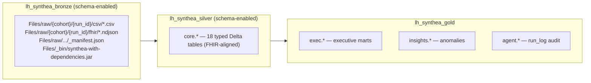

# 01 — Architecture & Storage Layout

This workspace implements a classic **medallion architecture** across three
Fabric lakehouses. Data flows strictly in one direction: bronze → silver → gold.



## Lakehouses

### `lh_synthea_bronze` — raw landing (schema‑enabled)
- **Purpose:** immutable raw output of the Synthea generator.
- **Format:** file‑based, not tables. Synthea writes CSV + FHIR NDJSON.
- **Path convention:**
  `Files/raw/<dataset_id>/<run_id>/{csv,fhir}/` plus a `_manifest.json` per run.
- **Binary cache:** `Files/_bin/synthea-with-dependencies.jar` (Synthea v3.2.0),
  downloaded once and reused across runs.
- **Manifest** (`_manifest.json`) records: `dataset_id`, `run_id`,
  `patient_count`, `state`, `modules`, `seed`, `started_at`, `finished_at`,
  output paths, and the list of CSV/FHIR files produced.

### `lh_synthea_silver` — conformed core (schema‑enabled)
- **Purpose:** typed, deduplicated, FHIR‑aligned clinical tables.
- **Schema:** `core` (e.g. `lh_synthea_silver.core.patients`).
- **18 tables**, one per Synthea CSV exporter (see [`04-data-model.md`](04-data-model.md)).
- **Governance columns** stamped on every row: `cohort_id`, `run_id`, `load_ts`,
  `source_file`.
- **Load method:** Delta `MERGE` on natural keys (idempotent).

### `lh_synthea_gold` — analytics & agent surface
- **Purpose:** business‑ready aggregates for executives and the insights agent.
- **Schemas:**
  - `exec` — `encounter_volumes`, `readmissions_30d`, `cost_summary`,
    `quality_measures`, `equity_demographics`.
  - `insights` — `daily_anomalies` (z‑score vs. 28‑day baseline).
  - `agent` — `run_log` (audit trail of agent executions).
- **Keying:** all `exec.*` / `insights.*` tables are keyed by
  `(date, cohort_id)` so a future semantic model can slice across cohorts and
  time via a shared `dim_date`.
- **Load method:** full **overwrite** (`overwriteSchema=true`) each run.

## Naming & multi‑tenancy conventions

| Concept | Convention | Example |
|---------|-----------|---------|
| Lakehouse | `lh_synthea_<layer>` | `lh_synthea_silver` |
| Cohort identity | `cohort_id` = `dataset_id` | `ma_diabetes` |
| Run identity | `<yyyyMMddHHmmss>-<dataset_id>` | `20260512131900-oncology` |
| Silver schema | `core` | `core.encounters` |
| Gold schemas | `exec`, `insights`, `agent` | `exec.cost_summary` |

## Cross‑lakehouse access

`02_bronze_to_silver` reads bronze files via an explicit OneLake ABFSS path
rather than relying on the attached default lakehouse:

```
abfss://synthea-data-ws@onelake.dfs.fabric.microsoft.com/
    lh_synthea_bronze.Lakehouse/Files/raw/<dataset_id>/<run_id>/csv
```

Silver and gold writes use the attached default lakehouse + three‑part
`saveAsTable`/`spark.sql` names (`<lakehouse>.<schema>.<table>`), which is why
both silver and gold are **schema‑enabled** lakehouses.

## Delta tuning

- Bronze→silver writes set `delta.autoOptimize.optimizeWrite=true` on table
  creation.
- `agent.run_log` sets both `optimizeWrite` and `autoCompact`.
- Gold tables use `mode("overwrite")` with `overwriteSchema=true` for clean,
  deterministic rebuilds.
