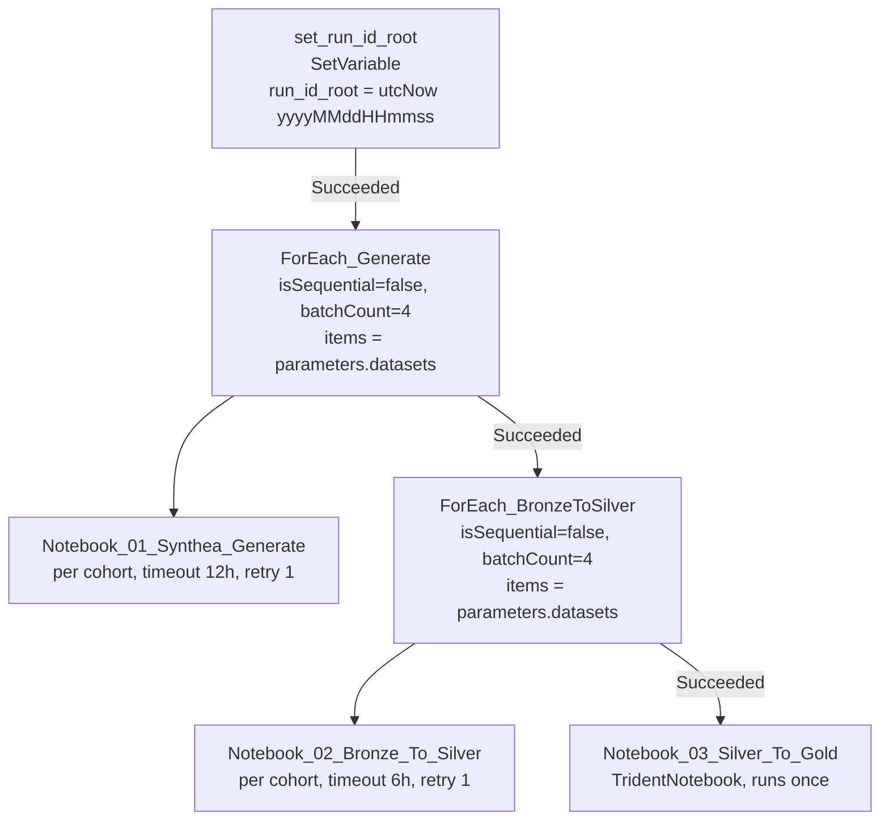

# 02 — Orchestration Pipeline: `synthea_full_run`

**Item ID:** `3785e03c-5a4c-4235-88e2-4bd19e22fa19`
**Description:** *Generates 8 Synthea datasets (~250K patients), promotes
bronze→silver for each, then builds gold marts. ForEach parallelism = 4.*
**Annotations:** `synthea`, `phase-1`, `healthcare-poc`

The pipeline is the single entry point for a full refresh. It runs four
activities in sequence, two of which fan out per cohort.

## Activity graph



## Stage detail

| # | Activity | Type | Runs | Notebook | Timeout / Retry |
|---|----------|------|------|----------|-----------------|
| 1 | `set_run_id_root` | SetVariable | once | — | — |
| 2 | `ForEach_Generate` → `Notebook_01_Synthea_Generate` | ForEach + TridentNotebook | per cohort (4 parallel) | `01_synthea_generate` | 12h / 1 |
| 3 | `ForEach_BronzeToSilver` → `Notebook_02_Bronze_To_Silver` | ForEach + TridentNotebook | per cohort (4 parallel) | `02_bronze_to_silver` | 6h / 1 |
| 4 | `Notebook_03_Silver_To_Gold` | TridentNotebook | once | `03_silver_to_gold` | 4h / 1 |

All ForEach loops use `isSequential=false` with `batchCount=4` → up to **4
cohorts processed concurrently** per stage. Each notebook activity retries once
with a 60s interval.

## The `run_id` contract

`set_run_id_root` computes a single timestamp string. Both the generate and
bronze→silver stages derive the per‑cohort run id identically:

```
run_id = concat(run_id_root, '-', item().dataset_id)
```

Because generate (which writes `Files/raw/.../<run_id>/`) and bronze→silver
(which reads that exact path and MERGEs) share the same `run_id`, the silver
MERGE is **idempotent** for a given pipeline run.

## Parameters

| Parameter | Type | Default | Notes |
|-----------|------|---------|-------|
| `as_of_date` | string | `@formatDateTime(utcNow(),'yyyy-MM-dd')` | Passed to gold; clips silver reads so re‑runs are deterministic |
| `notebook_id_01_generate` | string | `f6c4cde2-…` | Notebook GUID for stage 2 |
| `notebook_id_02_silver` | string | `4bcb6d3c-…` | Notebook GUID for stage 3 |
| `notebook_id_03_gold` | string | `976b7fbf-…` | Notebook GUID for stage 4 |
| `datasets` | array | 8 cohort objects | Drives both ForEach loops (see below) |

### `datasets` item shape

Each element is passed straight through to `01_synthea_generate` parameters:

```json
{
  "dataset_id":    "ma_diabetes",
  "patient_count": 50000,
  "state":         "Massachusetts",
  "modules":       "diabetes",
  "seed":          100001,
  "fhir_export":   true,
  "csv_export":    true
}
```

The eight default cohorts:

| `dataset_id` | Patients | State | Modules | FHIR | CSV | Seed |
|--------------|---------:|-------|---------|:----:|:---:|-----:|
| `ma_diabetes` | 50,000 | Massachusetts | `diabetes` | ✅ | ✅ | 100001 |
| `oncology` | 25,000 | Massachusetts | `breast_cancer,colorectal_cancer,lung_cancer` | ✅ | ✅ | 100002 |
| `claims_cpcds` | 50,000 | Massachusetts | *(all default)* | ❌ | ✅ | 100003 |
| `ehr_fhir` | 5,000 | Massachusetts | *(all default)* | ✅ | ❌ | 100004 |
| `sdoh` | 25,000 | Massachusetts | `homelessness,food_insecurity,unemployment` | ✅ | ✅ | 100005 |
| `houston_geo` | 40,000 | Texas | *(all default)* | ✅ | ✅ | 100006 |
| `provider_directory` | 500 | Massachusetts | *(all default)* | ❌ | ✅ | 100007 |
| `covid_national` | 55,000 | Massachusetts | `covid19` | ✅ | ✅ | 100008 |

## Operational notes

- **Variable:** `run_id_root` (String) — the only pipeline variable.
- **Gold runs once** after *all* cohorts complete silver, then overwrites the
  marts for everything up to `as_of_date`.
- `00_run_log_init` and `99_notebook_timing_report` are **not** part of this
  pipeline — run them manually as needed.
- A FHIR‑only cohort (`ehr_fhir`) will generate bronze output but contribute
  **no** silver rows, because `02_bronze_to_silver` only consumes CSV.
