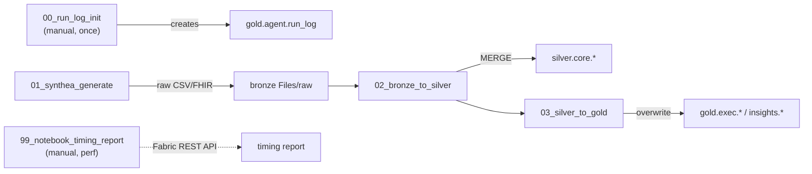

# 03 — Notebooks

Five PySpark notebooks. Three are wired into `synthea_full_run`
(`01`, `02`, `03`); `00` is a one‑time setup notebook and `99` is an ad‑hoc
performance collector.



---

## `00_run_log_init`
**Lakehouse:** `lh_synthea_gold` · **Run:** manually, once · **Idempotent:** yes

Creates the audit table written to by the Foundry CEO Insights agent (and any
other agent) at the end of every run.

- `CREATE SCHEMA IF NOT EXISTS lh_synthea_gold.agent`
- `CREATE TABLE IF NOT EXISTS lh_synthea_gold.agent.run_log (...)` with
  `delta.autoOptimize.optimizeWrite` + `autoCompact`.
- Exits via `mssparkutils.notebook.exit({"status":"ok", ...})`.

**`agent.run_log` schema**

| Column | Type | Notes |
|--------|------|-------|
| `run_id` | STRING (NOT NULL) | UUID generated by the agent (PK) |
| `agent_name` | STRING (NOT NULL) | e.g. `ceo-insights-agent` |
| `started_at` | TIMESTAMP (NOT NULL) | |
| `finished_at` | TIMESTAMP | |
| `prompt_summary` | STRING | trigger / question |
| `tools_called` | ARRAY\<STRING\> | |
| `output_summary` | STRING | first ~500 chars of the answer/email |
| `recipients` | ARRAY\<STRING\> | |
| `status` | STRING (NOT NULL) | `success` \| `failed` \| `partial` |
| `error` | STRING | nullable; set when `status != success` |

---

## `01_synthea_generate`
**Lakehouse:** `lh_synthea_bronze` · **Stage:** pipeline #2 (per cohort)

Runs the Synthea JAR on the Spark driver and lands raw output in bronze.

**Parameters:** `dataset_id`, `patient_count`, `state`, `modules`, `seed`,
`fhir_export`, `csv_export`, `clinical_note_export`, `run_id_override`.

**Logic**
1. Resolve `run_id` (from `run_id_override` or a new UUID) and output dir
   `Files/raw/<dataset_id>/<run_id>`.
2. In a single bash session: download Synthea **v3.2.0**
   `synthea-with-dependencies.jar` to `Files/_bin/` if not cached, then:
   ```
   java -Xmx6g -jar synthea-with-dependencies.jar \
     -p <patient_count> -s <seed> \
     --exporter.fhir.export=<bool> --exporter.csv.export=<bool> \
     --exporter.clinical_note.export=<bool> \
     --exporter.baseDirectory=$OUT \
     --exporter.csv.folder_per_run=false \
     --exporter.fhir.bulk_data=true \
     [-m "<modules>"] "<state>"
   ```
3. List produced `csv/*.csv` and `fhir/*.ndjson` files.
4. Write `_manifest.json` (params + file lists + timestamps).
5. Exit with the manifest JSON.

> Synthea generation runs **inside the driver** via `subprocess`, capturing the
> last 4 KB of stdout/stderr. A non‑zero exit raises `RuntimeError`.

---

## `02_bronze_to_silver`
**Lakehouse:** `lh_synthea_silver` · **Stage:** pipeline #3 (per cohort)

Reads the **18 Synthea CSV exporter tables** for a `(dataset_id, run_id)` from
bronze and MERGEs them into `lh_synthea_silver.core.*`.

**Parameters:** `dataset_id`, `run_id` (required).

**Logic**
- Reads each CSV via ABFSS from
  `lh_synthea_bronze.Lakehouse/Files/raw/<dataset_id>/<run_id>/csv`
  (`header`, `inferSchema`, `multiLine`, `escape='"'`, `nullValue=''`).
- Stamps every row with `cohort_id` (=`dataset_id`), `run_id`,
  `load_ts=current_timestamp()`, and `source_file`.
- **First load:** `write … saveAsTable` (overwrite create).
  **Subsequent:** Delta `MERGE` on the natural key with
  `whenMatchedUpdateAll` / `whenNotMatchedInsertAll`.
- Missing CSVs are skipped (status `missing`); any error re‑raises.
- Exits with a per‑table result list (`created`/`merged`/`missing`/`error` + row
  counts).

**Natural keys** (always prefixed by `cohort_id`):

| Table | Key columns |
|-------|-------------|
| `patients`, `encounters`, `organizations`, `providers`, `payers`, `claims`, `claims_transactions`, `imaging_studies`, `careplans` | `Id` |
| `conditions`, `procedures`, `medications`, `allergies`, `devices` | `PATIENT`, `ENCOUNTER`, `CODE`, `START` |
| `observations`, `immunizations`, `supplies` | `PATIENT`, `ENCOUNTER`, `CODE`, `DATE` |
| `payer_transitions` | `PATIENT`, `PAYER`, `START_DATE` |

---

## `03_silver_to_gold`
**Lakehouse:** `lh_synthea_gold` · **Stage:** pipeline #4 (once)

Builds executive marts and the anomaly table from `silver.core.*`. Fully
**overwrites** its outputs each run (idempotent up to `as_of_date`).

**Parameter:** `as_of_date` (ISO date; empty → today UTC). All silver reads are
clipped to `<= as_of_date` for deterministic re‑runs.

**Tables produced** (all keyed by `date, cohort_id`):

| Table | Grain / meaning |
|-------|-----------------|
| `exec.encounter_volumes` | daily encounter count by `encounter_class` |
| `exec.readmissions_30d` | inpatient 30‑day readmission rate (window `lead` over admit dates) |
| `exec.cost_summary` | `total_charges` (encounters) vs `total_payments` / `total_outstanding` (claims_transactions) |
| `exec.quality_measures` | starter measures: A1c control, BP control, flu vaccine (12mo) |
| `exec.equity_demographics` | encounters + cost by race / ethnicity / gender |
| `insights.daily_anomalies` | z‑score of daily encounters & charges vs 28‑day trailing baseline; severity high/medium/low/none |

> See [`04-data-model.md`](04-data-model.md) for full gold schemas and the
> clinical code sets used by the quality measures.

**Anomaly logic:** for each metric, a windowed mean/stddev over the prior
1–28 days yields `z = (current - baseline) / stddev`; severity buckets at
`|z| >= 3/2/1`.

---

## `99_notebook_timing_report`
**Run:** manual (performance triage) · **Not in the pipeline**

Ad‑hoc collector that reports **pool startup / Spark app / activity time per
notebook run** by calling the Fabric REST API.

- Auth: `notebookutils.credentials.getToken("https://api.fabric.microsoft.com")`
  — the running **user's** AAD token, no service principal/secrets.
- Reads `trident.workspace.id` from Spark conf.
- **Parameters:** `LOOKBACK_DAYS` (default 7), `NOTEBOOK_FILTER` (None = all),
  `PERSIST_TO_DELTA` (default False), `PERSIST_TABLE`
  (`agent.notebook_timing_report`).
- Optionally persists a snapshot to gold.
