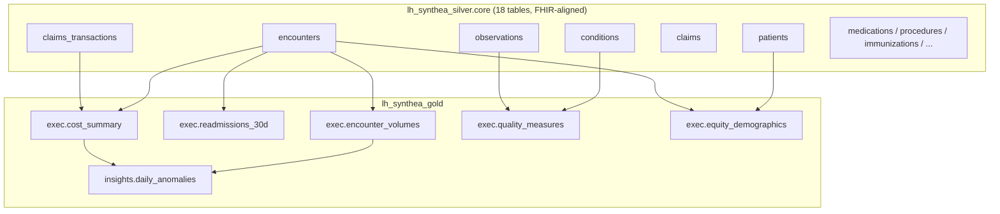

# 04 — Data Model

## Layer overview

---

## Silver — `lh_synthea_silver.core.*`

18 Delta tables, one per Synthea CSV exporter, with inferred schemas plus four
**governance columns** added to every table.

**Governance columns (all tables)**

| Column | Type | Meaning |
|--------|------|---------|
| `cohort_id` | string | logical cohort = `dataset_id` |
| `run_id` | string | Synthea generation run that produced the row |
| `load_ts` | timestamp | when this silver load ran |
| `source_file` | string | originating CSV filename |

**Tables and natural keys** (key always prefixed by `cohort_id`)

| Table | Natural key (besides cohort_id) | Notes |
|-------|--------------------------------|-------|
| `patients` | `Id` | demographics: `RACE`, `ETHNICITY`, `GENDER`, `BIRTHDATE`, … |
| `encounters` | `Id` | `ENCOUNTERCLASS`, `START`, `STOP`, `TOTAL_CLAIM_COST`, `PATIENT` |
| `organizations` | `Id` | |
| `providers` | `Id` | |
| `payers` | `Id` | |
| `claims` | `Id` | |
| `claims_transactions` | `Id` | `FROMDATE`, `PAYMENTS`, `OUTSTANDING` |
| `imaging_studies` | `Id` | |
| `careplans` | `Id` | |
| `conditions` | `PATIENT, ENCOUNTER, CODE, START` | SNOMED in `CODE` |
| `observations` | `PATIENT, ENCOUNTER, CODE, DATE` | LOINC in `CODE`, `VALUE` |
| `procedures` | `PATIENT, ENCOUNTER, CODE, START` | |
| `medications` | `PATIENT, ENCOUNTER, CODE, START` | |
| `immunizations` | `PATIENT, ENCOUNTER, CODE, DATE` | CVX in `CODE` |
| `allergies` | `PATIENT, ENCOUNTER, CODE, START` | |
| `devices` | `PATIENT, ENCOUNTER, CODE, START` | |
| `supplies` | `PATIENT, ENCOUNTER, CODE, DATE` | |
| `payer_transitions` | `PATIENT, PAYER, START_DATE` | |

---

## Gold — `lh_synthea_gold`

All `exec.*` and `insights.*` tables are keyed by **`(date, cohort_id)`** to
support a shared `dim_date` and cohort slicing in a future semantic model.

### `exec.encounter_volumes`
| Column | Type | Meaning |
|--------|------|---------|
| `date` | date | encounter start date |
| `cohort_id` | string | |
| `encounter_class` | string | from `encounters.ENCOUNTERCLASS` |
| `encounters` | long | count |

### `exec.readmissions_30d`
Index admissions = inpatient encounters discharged on `date`; a readmit = the
same patient's next inpatient admission within 0–30 days of discharge
(`lead` over admit dates per `cohort_id, patient`).

| Column | Type |
|--------|------|
| `date` | date (discharge date) |
| `cohort_id` | string |
| `index_admissions` | long |
| `readmits` | long |
| `readmit_rate` | double (`readmits / index_admissions`) |

### `exec.cost_summary`
Full‑outer join of encounter charges and claim‑transaction payments by day.

| Column | Type | Source |
|--------|------|--------|
| `date` | date | |
| `cohort_id` | string | |
| `total_charges` | double | `sum(encounters.TOTAL_CLAIM_COST)` |
| `total_payments` | double | `sum(claims_transactions.PAYMENTS)` |
| `total_outstanding` | double | `sum(claims_transactions.OUTSTANDING)` |

### `exec.quality_measures`
Population counts attributed to `as_of_date`. **Currently emits `cohort_id = "ALL"`
only** (per‑cohort breakdown is stubbed).

| Column | Type |
|--------|------|
| `date` | date |
| `cohort_id` | string (`ALL`) |
| `measure_id` | string |
| `numerator` | long |
| `denominator` | long |
| `rate` | double |

**Starter measures & code sets**

| `measure_id` | Denominator | Numerator condition | Codes used |
|--------------|-------------|---------------------|------------|
| `diabetes_a1c_control_lt_7` | patients with T2 diabetes | latest HbA1c ≤ 7.0 | dx SNOMED `44054006`; obs LOINC `4548-4` |
| `bp_control_sbp_le_140` | patients with hypertension | latest systolic BP ≤ 140 | dx SNOMED `59621000`, `38341003`; obs LOINC `8480-6` |
| `flu_vaccine_12mo_adults` | adults (≥18 at `as_of_date`) | flu immunization in prior 365d | CVX `140`, `88`, `158`, `150` |

### `exec.equity_demographics`
| Column | Type |
|--------|------|
| `date` | date |
| `cohort_id` | string |
| `race`, `ethnicity`, `gender` | string (from `patients`) |
| `encounters` | long |
| `total_cost` | double (`sum(TOTAL_CLAIM_COST)`) |

### `insights.daily_anomalies`
Z‑score of two daily metrics vs a **28‑day trailing baseline** (window over the
prior 1–28 days, per `cohort_id`).

| Column | Type | Meaning |
|--------|------|---------|
| `date` | date | |
| `cohort_id` | string | |
| `metric` | string | `daily_encounters` \| `daily_total_charges` |
| `current` | double | value on `date` |
| `baseline` | double | 28‑day trailing mean |
| `z_score` | double | `(current - baseline) / stddev_pop` |
| `severity` | string | `high` (\|z\|≥3) \| `medium` (≥2) \| `low` (≥1) \| `none` |

### `agent.run_log`
Audit trail created by `00_run_log_init`; written by the insights agent.
See [`03-notebooks.md`](03-notebooks.md#00_run_log_init) for the full schema.
