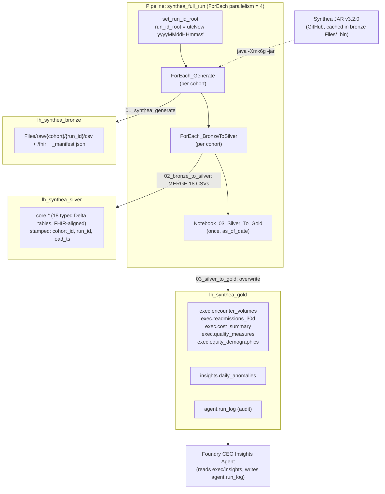
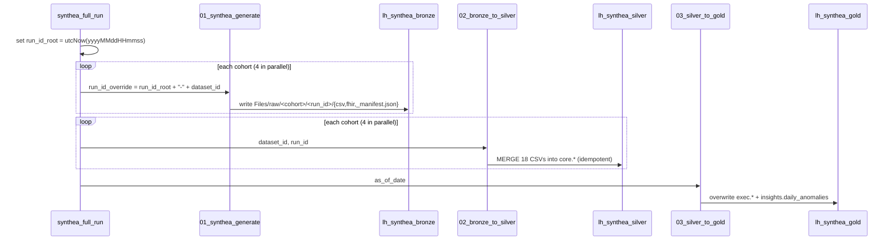

# synthea-data-ws — Fabric Workspace Documentation

A Microsoft Fabric workspace that generates large‑scale **synthetic healthcare
data** with [Synthea](https://github.com/synthetichealth/synthea) and refines it
through a **bronze → silver → gold medallion** architecture, ending in executive
analytics marts and an anomaly‑detection table designed to feed a Foundry
"CEO Insights" agent.

- **Workspace:** `synthea-data-ws`
- **Workspace ID:** `eae193ca-2b32-4100-b66f-4c6c5eb55c13`
- **Portal:** https://app.fabric.microsoft.com/groups/eae193ca-2b32-4100-b66f-4c6c5eb55c13/list
- **Created:** 11–12 May 2026
- **Tags:** `synthea`, `phase-1`, `healthcare-poc`

> All patient data in this workspace is **synthetic** (Synthea‑generated). It
> contains no real PHI/PII.

## Documentation index

| Doc | Contents |
|-----|----------|
| **README.md** (this file) | Workspace overview, inventory, end‑to‑end architecture |
| [`01-architecture.md`](01-architecture.md) | Medallion design, lakehouses, storage layout, naming |
| [`02-orchestration-pipeline.md`](02-orchestration-pipeline.md) | `synthea_full_run` pipeline: stages, parameters, the 8 cohorts |
| [`03-notebooks.md`](03-notebooks.md) | Cell‑by‑cell breakdown of all 5 notebooks |
| [`04-data-model.md`](04-data-model.md) | Silver `core.*` and gold `exec.*` / `insights.*` schemas |

---

## 1. Item inventory

The workspace contains **9 primary items** (plus 3 auto‑provisioned SQL analytics
endpoints).

| Item | Type | ID | Role |
|------|------|----|------|
| `lh_synthea_bronze` | Lakehouse (schema‑enabled) | `8cc329d2-badc-4fde-84f4-db93876c272e` | Raw Synthea CSV + FHIR landing zone |
| `lh_synthea_silver` | Lakehouse (schema‑enabled) | `a4e6f08f-aabc-4947-9bba-f5bc7d392f07` | Typed, conformed `core.*` tables (FHIR‑aligned) |
| `lh_synthea_gold` | Lakehouse | `ba9b4fb3-4adf-4832-84e7-c66842cf3967` | `exec.*` marts, `insights.*` anomalies, `agent.run_log` |
| `synthea_full_run` | Data Pipeline | `3785e03c-5a4c-4235-88e2-4bd19e22fa19` | Orchestrates generate → bronze→silver → gold for 8 cohorts |
| `00_run_log_init` | Notebook | `ec5928ce-c513-4fbd-988d-ceee96de91f5` | Creates the `agent.run_log` audit table |
| `01_synthea_generate` | Notebook | `f6c4cde2-3ea3-4036-bc52-4a1d08b83794` | Runs the Synthea JAR, lands raw CSV/FHIR + manifest |
| `02_bronze_to_silver` | Notebook | `4bcb6d3c-e3cc-40cc-96bb-99e6d52accb1` | MERGEs 18 CSV tables into `silver.core.*` |
| `03_silver_to_gold` | Notebook | `976b7fbf-da33-4196-8f23-634ace4c31bd` | Builds `exec.*` marts + `insights.daily_anomalies` |
| `99_notebook_timing_report` | Notebook | `01f9dacd-bbda-44c2-af90-8bd1325dde8d` | Ad‑hoc run‑timing/perf collector (not in the pipeline) |
| `lh_synthea_bronze` (SQL endpoint) | SQLEndpoint | `9da29010-2816-400d-8b4b-08342d918f7d` | Auto‑provisioned read endpoint |
| `lh_synthea_silver` (SQL endpoint) | SQLEndpoint | `37c0e6bc-8c60-4281-ac81-9a488fe371a5` | Auto‑provisioned read endpoint |
| `lh_synthea_gold` (SQL endpoint) | SQLEndpoint | `87968f9c-e3ab-4c93-9da7-af9044fb8579` | Auto‑provisioned read endpoint |

> There is currently **no semantic model or Power BI report** in the workspace,
> although `03_silver_to_gold` is explicitly shaped to feed one (all gold tables
> are keyed by `(date, cohort_id)` for a shared `dim_date`).

---

## 2. End‑to‑end architecture

### Run lifecycle (control flow)

---

## 3. The 8 cohorts (pipeline default)

`synthea_full_run` fans out over a `datasets` array — eight distinct
demonstration cohorts (~250K patients total). Each becomes an isolated
`cohort_id` throughout silver and gold.

| `dataset_id` | Patients | State | Synthea modules | FHIR | CSV |
|--------------|---------:|-------|-----------------|:----:|:---:|
| `ma_diabetes` | 50,000 | Massachusetts | `diabetes` | ✅ | ✅ |
| `oncology` | 25,000 | Massachusetts | `breast_cancer,colorectal_cancer,lung_cancer` | ✅ | ✅ |
| `claims_cpcds` | 50,000 | Massachusetts | *(all default)* | ❌ | ✅ |
| `ehr_fhir` | 5,000 | Massachusetts | *(all default)* | ✅ | ❌ |
| `sdoh` | 25,000 | Massachusetts | `homelessness,food_insecurity,unemployment` | ✅ | ✅ |
| `houston_geo` | 40,000 | Texas | *(all default)* | ✅ | ✅ |
| `provider_directory` | 500 | Massachusetts | *(all default)* | ❌ | ✅ |
| `covid_national` | 55,000 | Massachusetts | `covid19` | ✅ | ✅ |

> **Note:** `02_bronze_to_silver` reads **CSV** only. Cohorts exported as FHIR‑only
> (`ehr_fhir`) produce no silver `core.*` rows under the current code — their FHIR
> output lands in bronze but is not yet consumed downstream.

---

## 4. Key design decisions

- **Cohort isolation via `cohort_id`.** Every silver/gold row carries `cohort_id`
  (= `dataset_id`). It is always the leading column of every MERGE natural key,
  so cohorts never collide even though they share tables.
- **Deterministic, idempotent `run_id`.** The pipeline builds
  `run_id = <yyyyMMddHHmmss>-<dataset_id>` once and passes the *same* value to
  both generate and bronze→silver, so a re‑run MERGEs in place instead of
  duplicating.
- **Reproducible generation.** Each cohort pins a `seed`, so output is repeatable.
- **JAR caching + pinning.** Synthea `v3.2.0` is downloaded once to
  `bronze/Files/_bin/` and reused (chosen as the last Java‑11‑compatible release).
- **Gold is a full overwrite.** `exec.*` and `insights.*` are deterministic
  re‑derivations of silver up to `as_of_date` — safe to rebuild anytime.
- **Auditable agent runs.** `agent.run_log` (created by `00_run_log_init`) records
  every agent invocation: prompt, tools called, output summary, recipients, status.
- **User‑token auth.** The timing notebook uses `notebookutils.credentials.getToken`
  (the running user's AAD token) — no service principal or secrets in code.

---

## 5. Gaps & follow‑ups

- **No semantic model / report yet** — gold is modeled for one but it isn't built.
- **FHIR is generated but unused** downstream (only CSV is promoted to silver).
- **`exec.quality_measures` emits only the `ALL` cohort** today; per‑cohort
  breakdown is stubbed (the code notes it can loop over distinct `cohort_id`s).
- **`00_run_log_init` is not wired into the pipeline** — it must be run once
  manually (or added as a first activity) to create the audit table.
- **Quality‑measure code sets are minimal** (single SNOMED/LOINC/CVX codes per
  measure) and intended as a starter set.

*Source definitions for this documentation were pulled live from the Fabric REST
API (`getDefinition`) on the workspace items listed above.*
